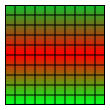
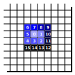

# 40. Bundeswettbewerb für Informatik - Aufgabe 3 (Wortsuche)

## Aufgabenstellung

Schreibe ein Programm, das eine gegebene Wortliste und die Größe des Rechtecks einliest und daraus Buchstabenrechtecke entsprechend deiner Schwierigkeitsgrade erzeugt.

## Lösungsidee

Das Hauptziel des Algorithmuses ist, dass verschiedene Wortfelder nach verschiedenen Schwierigkeitsgraden generiert werden sollen.

### Schwierigkeitsgrad **LEICHT**

Beim einfachsten Schwierigkeitsgrad des Algorithmuses können Wörter nur horizontal und vertikal positioniert werden und dürfen sich dabei nicht überschneiden. Des Weiteren werden die übrigen Stellen mit zufälligen Buchstaben aufgefüllt.

### Schwierigkeitsgrad **MITTEL**

Bei diesem Schwierigkeitsgrad des Algorithmuses können Wörter sowohl horizontal, als auch vertikal und diagonal (nicht überschneidend) platziert werden. Die übrigen Stellen werden hierbei nur mit zufälligen Buchstaben aufgefüllt, welche in den Wörtern der Wortliste enthalten sind (können auch alle sein).

### Schwierigkeitsgrad **SCHWER**

Beim letzten Schwierigkeitsgrad des Algorithmuses können Wörter horizontal, vertikal und diagonal platziert werden und können sich dabei auch überschneiden. Außerdem werden die Leerstellen mit Fragmenten der Wörter der Wortliste aufgefüllt (keine zufälligen Buchstaben).

## Verwendung des Programmes

Das Programm zur Lösung dieses Problemes befindet sich in der Datei "Aufgabe_3.jar". Das Programm kann mit der Befehlszeile (CMD auf Windows bzw. Terminal auf MacOS) ausgeführt werden.
Dafür navigiert man zuerst in den Ordner der JAR-Datei (hier Aufgabe 3). Anschließend führt man den Befehl "java -jar Aufgabe_3.jar \<Eingabedatei> \<Ausgabedatei>" aus.
Die Ausgabedatei ist optional. Wenn keine Ausgabedatei angegeben ist, dann wird das Ergebnis als "output.txt" in dem Ordner der JAR-Datei gespeichert.

## Implementierung

### Einlesen der Beispieldateien

```java
//Lesen der einzelnen Zeilen der Datei
String line;
while((line = streamReader.readLine()) != null) contentBuilder.append(line).append("\n");

//Aufteilen des gelesenen Textes in die einzelnen Dateien
String[] contentLines = contentBuilder.toString().split("\n");

//Interpretieren der Daten
//Einlesen der Höhe und der Breite der Wortliste
height = Integer.parseInt(contentLines[0].split(" ")[0]);
width = Integer.parseInt(contentLines[0].split(" ")[1]);

//Einlesen der Wortanzahl
wordCount = Integer.parseInt(contentLines[1]);

//Einlesen der Wortliste
words.addAll(Arrays.asList(contentLines).subList(2, wordCount + 2));
```

### Allgemein

Die abstrakte Klasse "PatternGenerator" beeinhaltet die Grundfunktionen/-methoden und die Hauptschleife des Algorithmuses. Die Generatoren für die verschiedenen Schwierigkeitsgrade sind von dieser Klasse abgeleitet.

```java
public String generatePattern() {
    //Variablen werden initialisiert
    int placementAttempts = 0;
    pattern = new String[height][width];
    placedWords.clear();
    closedPositions.clear();

    //Wortliste wird nach der Größe absteigend sortiert und der Queue hinzugefügt
    Collections.sort(words);
    Collections.reverse(words);
    wordQueue.addAll(words);

    //Alle Felder des Wortfeldes werden mit einem Leerzeichen aufgefüllt
    prepareEmptySpaces();

    //Hauptschleife des Algorithmus
    while(wordQueue.peek() != null) { //Solange Elemente in der Queue enthalten sind
        placementAttempts++; //Versuchszahl wird erhöht
        if(placementAttempts > wordCount * 3) {
            //Bei zu vielen Versuchen wird der Algorithmus abgebrochen, sodass kein Stackoverflow entsteht
            System.err.println("Failed to fit all words on the board. Restarting...");
            return generatePattern();
        }

        //Das Wort wird aus der Queue entfernt, wenn es erfolgreich platziert werden konnte
        if(placeWord(wordQueue.peekFirst())) wordQueue.removeFirst();
    }

    //Verbleibende Leerstellen auffüllen
    fillEmptySpaces();

    //Rückgabe des generierten Wortfeldes
    return formatMatrix(pattern);
}
```

Der Algorithmus zum Generieren eines Wortes arbeitet mit einer while-Schleife, welche ein Deque-Objekt durchläuft. In der Queue (Warteschlange) befinden sich alle Wörter, welche noch auf dem Wortfeld platziert werden sollen. Die Wörter werden der Länge nach absteigend sortiert der Queue hinzugefügt, sodass die längsten Wörter zuerst platziert werden.
Die while-Schleife läuft dann, solange sich Elemente (Wörter) in der Queue befinden. Allerdings wird die Schleife automatisch abgebrochen, wenn die Schleife 3-mal so lang, wie die Wortliste eigentlich ist durchlaufen wurde. Wenn sich also 10 Wörter in der Queue befinden, dann wird der Algorithmus nach 30 Iterationen spätestens abgebrochen, da es dann sehr wahrscheinlich ist, dass die Wörter nicht alle gleichzeitig auf dem Wortfeld platziert werden können.

Der Algorithmus wählt also immer das erste Wort aus der Queue und versucht dieses über die Funktion #placeWord dem Feld hinzuzufügen. Diese Funktion wird durch die verschiedenen Klassen der verschiedenen Schwierigkeitsgrade implementiert und gibt einen boolean zurück, welcher angibt, ob das Wort erfolgreich hinzugefügt werden konnte. Wenn der Vorgang erfolgreich war, wird das Wort aus der Queue entfernt und das nächste Wort in der Warteschlange wird bearbeitet. Wenn das Wort nicht hinzugefügt werden konnte, dann verbleibt es in der Queue und wird anschließend erneut abgearbeitet.

Wenn alle Wörter dem Wortfeld hinzugefügt werden konnten, füllt der Algorithmus alle verbleibenden leeren Felder auf. Wie diese aufgefüllt werden hängt jedoch vom Schwierigkeitsgrad ab und wird folglich von den einzelnen Generatorklassen implementiert.

Zum Schluss formatiert der Algorithmus das Wortfeld von einem zweidimensionalen Array in einen String und gibt diesen zurück, sodass dieser ausgegebenen werden kann.

### Schwierigkeitsgrad: Leicht

Die Klasse "EasyPatternGenerator" bildet die Grundlage für das Generieren eines Wortfeldes, da alle Klassen der höheren Schwierigkeitsgrade von dieser ableiten. Der Algorithmus zur Generierung eines solchen Feldes ist für diesen Schwierigkeitsgrad wie folgt aufgebaut:  
**1.** Die Orientierung des Wortes wird zufällig generiert (Horizontal oder Vertikal)  
**2.** Die Position des Wortes wird mithilfe eines weiteren Zufallsgenerators und einer bestimmten Gewichtung generiert  
**3.** Das Wort wird an der generierten Position hinzugefügt  
    a. Wenn dies fehlschlägt, dann versucht der Algorithmus es erneut (maximal 3 Versuche, bevor false zurückgegeben wird)  
    b. Wenn der Vorgang erfolgreich war, wird true zurückgegeben, sodass das nächste Wort bearbeitet werden kann  
**4.** Die verbleibenden leeren Felder werden mit zufälligen Buchstaben aus dem Alphabet aufgefüllt  

```java
//Berechnung einer zufälligen Zahl
switch(instanceRandom.nextInt(2)) {
    //Das neue Wort wird horizontal ausgerichet
    case 0:
        //Die Positionierung wird 3 mal wiederholt, falls es nicht funktionieren sollte
        for(int i = 0; i <= maxAttempts; i++) {
            int[] position = getPositionForWord(word, WordPosition.Orientation.Horizontal);
            if(placeWordHorizontally(word, position[0], position[1], false))
                //Die Positionierung war erfolgreich
                return true;
        }

        //Alle drei Versuche zur Positionierung des Wortes schlugen fehl
        return false;
    case 1:
        //Die Positionierung wird 3 mal wiederholt, falls es nicht funktionieren sollte
        for(int i = 0; i <= maxAttempts; i++) {
            int[] position = getPositionForWord(word, WordPosition.Orientation.Vertical);
            if(placeWordVertically(word, position[0], position[1], false))
                //Die Positionierung war erfolgreich
                return true;
        }

        //Alle drei Versuche zur Positionierung des Wortes schlugen fehl
        return false;
    default: return false;
}
```

Beim ersten Schwierigkeitsgrad ergibt sich das Problem, dass unter Umständen nicht immer alle Wörter direkt auf das Wortfeld passen, wenn diese vollständig zufällig platziert werden. Dieses Problem entsteht dadurch, dass Wörter nicht diagonal und auch nicht überschneidend platziert werden dürfen. Daher gibt es bei diesem Schwierigkeitsgrad bestimmte Bereiche, in den die Wörter besonders häufig vorkommen.

**Bei horizontaler Ausrichtung**

Wenn das Wort horizontal ausgerichtet werden soll, dann ist die Wahrscheinlichkeit, dass die Wörter am Rand des Wortfeldes auftauchen höher, als in der Mitte. Dabei spielt die X-Koordinate des Wortes keine Rolle und wird zufällig generiert.  
Die Y-Koordinate wird hier jedoch nach einer bestimmten Wahrscheinlichkeit generiert. Diese Verteilung wurde gewählt, um möglichst viel Platz für die anderen Wörter zu ermöglichen (vertikal bzw. hauptsächlich für diagonal).
Dazu teilt der Algorithmus das Wortfeld in drei gleich große Bereiche auf, welche jeweils die Wahrscheinlichkeiten 40 %, 20 % und 40 % haben.  
Nachdem der Algorithmus einen bestimmten Bereich anhand der Wahrscheinlichkeiten gewählt hat, wird die genaue Position des Wortes innerhalb dieses Bereiches zufällig generiert. Diese Position wird dann zum Schluss zurückgegeben.



```java
//X-Koordinate wird zufällig generiert
int hx = instanceRandom.nextInt(width - word.length());

int[][] verticalSections = new int[3][2];
int verticalSectionIndex = 0;

//Einteilung des Feldes in drei gleich große Bereiche
//Erstes Drittel des Feldes
verticalSections[0][0] = 0;
verticalSections[0][1] = height / 3;

//Zweites Drittel des Feldes
verticalSections[1][0] = height / 3;
verticalSections[1][1] = (height / 3) * 2;

//Letztes Drittel des Feldes
verticalSections[2][0] = (height / 3) * 2;
verticalSections[2][1] = height;

//Zufällige Auswahl des Bereiches nach den verschiedenen Wahrscheinlichkeiten
int verticalSectionSelection = instanceRandom.nextInt(100);

//Erstes Drittel (40 %)
if(verticalSectionSelection < 40) verticalSectionIndex = 0;
//Zweites Drittel (20 %)
else if(verticalSectionSelection < 60) verticalSectionIndex = 1;
//Letztes Drittel (40 %)
else verticalSectionIndex = 2;

//Auswahl einer zufälligen Koordinate innerhalb des ausgewählten Bereiches
int hy = yGenerator.generate(verticalSections[verticalSectionIndex][1] - verticalSections[verticalSectionIndex][0]) + verticalSections[verticalSectionIndex][0];

//Rückgabe der berechneten Koordinaten
return new int[] { hx, hy };
```

**Bei vertikaler Ausrichtung**

Wenn das Wort vertikal ausgerichtet werden soll, dann ist die Wahrscheinlichkeit, dass die Wörter am Rand des Wortfeldes auftauchen höher, als in der Mitte. Dabei spielt die Y-Koordinate des Wortes keine Rolle und wird zufällig generiert.  
Die X-Koordinate wird hier jedoch nach einer bestimmten Wahrscheinlichkeit generiert. Diese Verteilung wurde gewählt, um möglichst viel Platz für die anderen Wörter zu ermöglichen (horizontal bzw. hauptsächlich diagonal).  
Dazu teilt der Algorithmus das Wortfeld in drei gleich große Bereiche auf, welche jeweils die Wahrscheinlichkeiten 40 %, 20% und 40 % haben.  
Nachdem der Algorithmus einen bestimmten Bereich anhand der Wahrscheinlichkeiten gewählt hat, wird die genaue Position des Wortes innerhalb dieses Bereiches zufällig generiert. Diese Position wird dann zum Schluss zurückgegeben.


```java
//Y-Koordinate wird zufällig generiert
int vy = instanceRandom.nextInt(height - word.length());

int[][] horizontalSections = new int[3][2];
int horizontalSectionIndex = 0;

//Einteilung des Feldes in drei gleich große Bereiche
//Erstes Drittel des Feldes
horizontalSections[0][0] = 0;
horizontalSections[0][1] = width / 3;

//Zweites Drittel des Feldes
horizontalSections[1][0] = width / 3;
horizontalSections[1][1] = (width / 3) * 2;

//Letztes Drittel des Feldes
horizontalSections[2][0] = (width / 3) * 2;
horizontalSections[2][1] = width;

//Zufällige Auswahl des Bereiches nach den verschiedenen Wahrscheinlichkeiten
int horizontalSectionSelection = instanceRandom.nextInt(100);

//Erstes Drittel (40 %)
if(horizontalSectionSelection < 40) horizontalSectionIndex = 0;
//Zweites Drittel (20 %)
else if(horizontalSectionSelection < 60) horizontalSectionIndex = 1;
//Letztes Drittel (40 %)
else horizontalSectionIndex = 2;

//Auswahl einer zufälligen Koordinate innerhalb des ausgewählten Bereiches
int vx = xGenerator.generate(horizontalSections[horizontalSectionIndex][1] - horizontalSections[horizontalSectionIndex][0]) + horizontalSections[horizontalSectionIndex][0];

//Rückgabe der berechneten Koordinaten
return new int[] { vx, vy };
```

#### **Horizontale Platzierung der Wörter**

Um ein Wort horizontal zu platzieren wird eine zufällige Position generiert, wenn dies vorher nicht geschehen ist. Anschließend überprüft der Algorithmus, ob an der Stelle im Feld überhaupt genügend platz vorhanden ist. Dazu durchläuft eine Schleife alle Positionen von der X-Koordinate bis zur Position X + Länge des Wortes. Wenn alle Positionen frei sind, dann fährt der Algorithmus fort und platziert das Wort mithilfe einer Schleife auf dem Feld. Andernfalls wird hier false zurückgegeben, da das Wort nicht platziert werden konnte.  
Nachdem das Wort positioniert wurde, wird das Wort in die Liste der positionierten Wörter aufgenommen und die Position wird in eine Ausnahmeliste des Zufallsgenerators aufgenommen, sodass die gleiche Position nicht zufällig erneut ausgewählt werden kann.  
Der Parameter "crossingAllowed" hat für diesen Schwierigkeitsgrad keine Bedeutung.

```java
protected boolean placeWordHorizontally(String word, int optionalX, int optionalY, boolean crossingAllowed) {
    //Initialisieren der Koordinaten
    int positionX = optionalX;
    int positionY = optionalY;

    //Berechnen der Koordinaten
    if(positionY == COORDINATE_GENERATE) positionY = yGenerator.generate(pattern.length);
    if(positionX == COORDINATE_GENERATE) positionX = pattern[positionY].length - word.length() != 0 ? xGenerator.generate(pattern[positionY].length - word.length()) : 0;

    //Überprüfen der Position, in welcher das Wort platziert werden soll
    for(int i = 0; i < word.length(); i++) {
        if(!pattern[positionY][positionX + i].equals(CHARACTER_EMPTY) && !pattern[positionY][positionX + i].equals(String.valueOf(word.charAt(i)))) {
            return false;
        }
    }

    //Platzieren des Wortes auf dem Board
    for(int x = 0; x < word.length(); x++) pattern[positionY][positionX + x] = String.valueOf(word.charAt(x));
    placedWords.put(word, new WordPosition(positionX, positionY, WordPosition.Orientation.Horizontal));
    addClosedCoordinate(positionX, positionY);
    return true;
}
```

#### **Vertikale Platzierung der Wörter**

Um ein Wort vertikal zu platzieren wird eine zufällige Position generiert, wenn dies vorher nicht geschehen ist. Anschließend überprüft der Algorithmus, ob an der Stelle im Feld überhaupt genügend Platz vorhanden ist. Dazu durchläuft eine Schleife alle Positionen von der Y-Koordinate bis zur Position Y + Länge des Wortes. Wenn alle Positionen frei sind, dann fährt der Algorithmus fort und platziert das Wort mithilfe einer Schleife auf dem Feld. Andernfalls wird hier false zurückgegeben, da das Wort nicht platziert werden konnte.  
Nachdem das Wort positioniert wurde, wird das Wort in die Liste der positionierten Wörter aufgenommen und die Position wird in eine Ausnahmeliste des Zufallsgenerators aufgenommen, sodass die gleiche Position nicht zufällig erneut ausgewählt werden kann.  
Der Parameter "crossingAllowed" hat für diesen Schwierigkeitsgrad keine Bedeutung.

```java
protected boolean placeWordVertically(String word, int optionalX, int optionalY, boolean crossingAllowed) {
    //Initialisieren der Koordindaten
    int positionX = optionalX;
    int positionY = optionalY;

    //Berechnen der Koordinaten
    if(positionY == COORDINATE_GENERATE) positionY = pattern.length - word.length() != 0 ? yGenerator.generate(pattern.length - word.length()) : 0;
    if(positionX == COORDINATE_GENERATE) positionX = xGenerator.generate(pattern[positionY].length);

    //Überprüfen der Position, in welcher das Wort platziert werden soll
    for(int i = 0; i < word.length(); i++) {
        if(!pattern[positionY + i][positionX].equals(CHARACTER_EMPTY) && (!pattern[positionY + i][positionX].equals(String.valueOf(word.charAt(i))))) {
            return false;
        }
    }

    //Platzieren des Wortes auf dem Board
    for(int y = 0; y < word.length(); y++) pattern[positionY + y][positionX] = String.valueOf(word.charAt(y));
    placedWords.put(word, new WordPosition(positionX, positionY, WordPosition.Orientation.Vertical));
    addClosedCoordinate(positionX, positionY);
    return true;
}
```

### Schwierigkeitsgrad: Mittel

Zum Generieren von Wortfeldern des mittleren Schwierigkeitsgrades wird die Klasse "MediumPatternGenerator" verwendet, welche von der Klasse zur Generierung von leichten Wortfeldern abgeleitet ist. Daher beeinhaltet der Schwierigkeitsgrad Mittel alle Abfolgen des Schwierigkeitsgrades Leicht mit einigen Ergänzungen.

Die erste Ergänzung ist, dass Wörter hier nun auch diagonal (aufsteigend und absteigend) positioniert werden können.

#### **Diagonal aufsteigende Positionierung eines Wortes**

Um ein Wort diagonal aufsteigend zu platzieren wird eine zufällige Position generiert, wenn dies vorher nicht geschehen ist. Anschließend überprüft der Algorithmus, ob an der Stelle im Feld überhaupt genügend Platz vorhanden ist. Dazu durchläuft eine Schleife alle Positionen von der X-Koordinate zur Position X + Länge des Wortes und alle Positionen von der Y-Koordinate zur Position Y - Länge des Wortes. Wenn alle Positionen frei sind, dann fährt der Algorithmus fort und platziert das Wort mithilfe einer Schleife auf dem Feld. Andernfalls wird hier false zurückgegeben, da das Wort nicht platziert werden konnte.  
Nachdem das Wort positioniert wurde, wird das Wort in die Liste der positionierten Wörter aufgenommen und die Position wird in eine Ausnahmeliste des Zufallsgenerators aufgenommen, sodass die gleiche Position nicht zufällig erneut ausgewählt werden kann. Diagonale Wörter können außerdem nur an Positionen platziert werden, welche gerade Zahlen sind (x % 2 == 0), da ansonsten Überschneidungen entstehen, welche ungültig sind.
Der Parameter "crossingAllowed" hat für diesen Schwierigkeitsgrad keine Bedeutung.

```java
//Berechnen der Koordinaten für die Richtung: diagonal aufsteigend
if(positionY == COORDINATE_GENERATE) positionY = pattern.length - word.length() != 0 ? yGenerator.generate(pattern.length - word.length()) + word.length() - 1 : pattern.length - 1;
if(positionX == COORDINATE_GENERATE) positionX = pattern[positionY].length - word.length() != 0 ? xGenerator.generate(pattern[positionY].length - word.length()) : 0;

//Überprüfen der Position auf dem Wortfeld
for(int i = 0; i < word.length(); i++) {
    if((positionX % 2 == 0 || positionY % 2 == 0) || (!pattern[positionY - i][positionX + i].equals(CHARACTER_EMPTY) && (!pattern[positionY - i][positionX + i].equals(String.valueOf(word.charAt(i)))))) {
        return false;
    }
}

//Platzieren des Wortes auf dem Wortfeld
for(int i = 0; i < word.length(); i++) pattern[positionY - i][positionX + i] = String.valueOf(word.charAt(i));
placedWords.put(word, new WordPosition(positionX, positionY, WordPosition.Orientation.DiagonalUp));
```

#### **Diagonal absteigende Positionierung eines Wortes**

Um ein Wort diagonal absteigend zu platzieren wird eine zufällige Position generiert, wenn dies vorher nicht geschehen ist. Anschließend überprüft der Algorithmus, ob an der Stelle im Feld überhaupt genügend Platz vorhanden ist. Dazu durchläuft eine Schleife alle Positionen von der X-Koordinate bis zur Position X + Länge des Wortes und von der Y-Koordinate zur Position Y + Länge des Wortes. Wenn alle Positionen frei sind, dann fährt der Algorithmus fort und platziert das Wort mithilfe einer Schleife auf dem Feld. Andernfalls wird hier false zurückgegeben, da das Wort nicht platziert werden konnte.
Nachdem das Wort positioniert wurde, wird das Wort in die Liste der positionierten Wörter aufgenommen und die Position wird in eine Ausnahmeliste des Zufallsgenerators aufgenommenm sodass die gleiche Position nicht zufällig erneut ausgewählt werden kann. Diagonale Wörter können außerdem nur an Positionen platziert werden, welche gerade Zahlen sind (x % 2 == 0), da ansonsten Überschneidungen entstehen, welche ungültig sind.
Der Parameter "crossingAllowed" hat für diesen Schwierigkeitsgrad keine Bedeutung.

```java
 //Berechnen der Koordinaten für die Richtung: diagonal absteigend
if(positionY == COORDINATE_GENERATE) positionY = pattern.length - word.length() != 0 ? yGenerator.generate(pattern.length - word.length()) : 0;
if(positionX == COORDINATE_GENERATE) positionX = pattern[positionY].length - word.length() != 0 ? xGenerator.generate(pattern[positionY].length - word.length()) : 0;

//Überprüfen der Position auf dem Wortfeld
for(int i = 0; i < word.length(); i++) {
    if((positionX % 2 == 0 || positionY % 2 == 0) || (!pattern[positionY + i][positionX + i].equals(CHARACTER_EMPTY) && (!pattern[positionY + i][positionX + i].equals(String.valueOf(word.charAt(i)))))) {
        return false;
    }
}

//Platzieren des Wortes auf dem Wortfeld
for(int i = 0; i < word.length(); i++) pattern[positionY + i][positionX + i] = String.valueOf(word.charAt(i));
placedWords.put(word, new WordPosition(positionX, positionY, WordPosition.Orientation.DiagonalDown));
```

#### **Auffüllen von leeren Stellen**

Der Algorithmus zur Generierung der Wortfelder von diesem Schwierigkeitsgrad verwendet eine andere Implementierung zur Auffüllung der Leerzeichen, welche am Ende aufgefüllt werden sollen. Im Gegensatz zu den einfachen Wortfeldern werden hier keine zufälligen Buchstaben mehr verwendet. Stattdessen verwendet der Algorithmus nur Buchstaben, welche auch in den Wörtern aus der Wortliste enthalten sind. In einigen Fällen kann dies aber auch dazu führen, dass dies das ganze Alphabet umfasst.

```java
//Sammeln aller Buchstaben, welche in den Wörtern aus der Wortliste enthalten sind
ArrayList<String> letterSet = new ArrayList<>();
for(String word : words) {
    for(int i = 0; i < word.length(); i++) {
        if(!letterSet.contains(String.valueOf(word.charAt(i))))
            letterSet.add(String.valueOf(word.charAt(i)));
    }
}

//Auffüllen der Leerstellen mit zufälligen Buchstaben aus der Liste
for(int x = 0; x < width; x++) {
    for(int y = 0; y < height; y++) {
        if(Objects.equals(pattern[y][x], CHARACTER_EMPTY)) {
            //Hinzufügen des Buchstabens zum Wortfeld
            pattern[y][x] = letterSet.get(instanceRandom.nextInt(letterSet.size()));

            //Speichern des Punktes zur späteren Überprüfung der Auffüllung
            filledPoints.add(new Point(x, y));
        }
    }
}

//Überprüfung der automatischen Auffüllung
checkFilledSpaces(letterSet);
```

Dazu sammelt der Algorithmus zuerst alle Buchstaben, welche in den Wörtern aus der Wortliste enthalten sind. Anschließend füllt er alle Leerstellen mit zufälligen Buchstaben aus dieser Liste auf. Dabei werden die Stellen, welche aufgefüllt werden für den späteren Zeitpunkt der Überprüfung gespeichert.

#### **Überprüfung der Auffüllung**

Nachdem die leeren Stellen aufgefüllt wurden, muss der Algorithmus das Feld erneut überprüfen, da es unter Umständen passieren kann, dass durch das Auffüllen Wörter aus der Wortliste entstanden sind und folglich doppelt enthalten sind.  
Zur Überprüfung der Auffüllung verwendet der Algorithmus eine Schleife, welche das Wortfeld von innen nach außen spiralförmig durchläuft (siehe Abbildung).



Der folgende Code wird verwendet, um die spiralförmige Schleife zu realisieren:

```java
int currentX = 0, currentY = 0; //Aktuelle Position
int deltaX = 0, deltaY = -1; //Delta der beiden Positionen, welche bei der nächsten Iteration angewendet werden

//Höhe/Breite werden hier als Spalten/Zeilen bezeichnet, da der zugrundeliegende Algorithmus ursprünglich zum Durchlaufen von Matrizen entwickelt wurde.
int rows = height;
int cols = width;

//Hauptschleife, welche das Feld spiralförmig durchläuft
for(int i = 0; i < Math.pow(Math.max(rows, cols), 2); i++) {
    if(currentX >= -rows / 2 && currentX <= rows / 2 && currentY >= -cols / 2 && currentY <= cols / 2) {
        //Umrechnung, da currentX und currentY den Abstand vom Mittelpunkt des Feldes angeben und nicht die absolute Position
        int actualX = (int)Math.ceil((width / 2.0) + (double)currentX);
        int actualY = (int)Math.ceil((height / 2.0) + (double)currentY);

        if(actualX > 0 && actualX < width && actualY > 0 && actualY < height) {
            //Überprüfen der Buchstaben
            checkFilledPosition(actualX, actualY, letterSet);
        }
    }

    if((currentX == currentY) || (currentX == -currentY && currentX < 0) || (currentX == 1 - currentY && currentX > 0)) {
        //Richtungsumkehr
        int copy = deltaX;
        deltaX = -deltaY;
        deltaY = copy;
    }

    //Anwenden der Deltas auf die aktuelle Position
    currentX = currentX + deltaX;
    currentY = currentY + deltaY;
}
```

Die Methode #checkFilledPosition ist die eigentliche Methode, welche die Platzierung der Buchstaben überprüft und gegebenenfalls ersetzt. Diese Methode überprüft das Umfeld des Buchstabens in einem Radius von drei Einheiten und ersetzt die Buchstaben gegebenenfalls, sodass keine doppelten Wörter entstehen. Die Methode überprüft vorher, ob die Stelle, welche überprüft wird, überhaupt überprüft werden muss. Dazu verwendet sie die Liste an Positionen, welche aufgefüllt wurden. Diese Liste wurde im vorherigen Schritt (Auffüllungen) erzeugt.

```java
protected void checkFilledPosition(int posX, int posY, ArrayList<String> fullLetterSet) {
    //Überprüfen und Auffüllen der Buchstaben
    ArrayList<String> reducedLetterSet = new ArrayList<>(fullLetterSet);

    //Überprüfen aller Positionen im Umkreis von 3 Einheiten
    for(int x = -FILL_CHECK_RADIUS; x <= FILL_CHECK_RADIUS; x++) {
        for(int y = -FILL_CHECK_RADIUS; y <= FILL_CHECK_RADIUS; y++) {
            int checkX = posX + x;
            int checkY = posY + y;

            //Entfernen der Buchstaben aus dem Umfeld aus der Liste der verfügbaren Buchstaben
            if(checkX >= 0 && checkX < width && checkY >= 0 && checkY < height && pattern[checkY][checkX] != null)
                reducedLetterSet.remove(pattern[checkY][checkX]);
        }
    }

    //Platzieren des neuen Buchstabens innerhalb des Feldes
    if(filledPoints.contains(new Point(posX, posY)) && reducedLetterSet.size() == 0)
        pattern[posY][posX] = getRandomChar();
}
```

Der gesamte Ablauf zur Überprüfung der platzierten Buchstaben wird insgesamt 5-mal wiederholt, um so viele Fehler wie möglich auszuschließen und das Feld so weit wie möglich zu optimieren.

### Schwierigkeitsgrad: Schwer

Zum Generieren von Wortfeldern des höchsten Schwierigkeitsgrades wird die Klasse "HardPatternGenerator" verwendet, welche von der Klasse zur Generierung von mittleren Wortfeldern abgeleitet ist. Daher beeinhaltet der Schwierigkeitsgrad Schwer alle Abfolgen des Schwierigkeitsgrades Mittel mit einigen Ergänzungen.

Dabei beeinhaltet der Algorithmus Abwandlungen aller Positionierungsfunktionen der Wörter, sodass sich diese nun überschneiden können. Dabei werden Wörter nun mit Absicht überschneidend platziert, wenn kein freier Platz gefunden werden konnte. Dies geschieht mit der Funktion #placeWordCrossing, wobei nun auch der Parameter "crossingAllowed" zum Einsatz kommt, welcher für die niederen Schwierigkeitsgrade keine Rolle spielte.

#### **Neue Funktion zur horizontalen Positionierung**

```java
if(!super.placeWordHorizontally(word, optionalX, optionalY, crossingAllowed))
    //Überschneidung Platzierung, wenn keine Position gefunden werden kann
    return crossingAllowed && placeWordCrossing(word);
else return true;
```

#### **Neue Funktion zur vertikalen Positionierung**

```java
if(!super.placeWordVertically(word, optionalX, optionalY, crossingAllowed))
    //Überschneidende Platzierung, wenn keine Position gefunden werden kann
    return crossingAllowed && placeWordCrossing(word);
else return true;
```

#### **Neue Funktion zur diagonalen Positionierung**

```java
if(!super.placeWordDiagonally(word, optionalX, optionalY, orientation, crossingAllowed))
    //Überschneidende Platzierung, wenn keine Position gefunden werden kann
    return crossingAllowed && placeWordCrossing(word);
else return true;
```

#### **Überschneidende Platzierung von Wörtern**

Die Funktion #placeWordCrossing sucht ein passendes Wort, welches das gegebene Wort überschneidet. Anschließend wird zufällig eine der Ausrichtungen für das zu positionierende Wort ausgewählt (Horizontal, Vertikal, Diagonal). Danach wird anhand des Schnittpunktes der beiden Wörter die Position des Wortes berechnet. Zum Schluss wird das Wort an der berechneten Stelle platziert. Falls dies nicht möglich ist, gibt auch diese Funktion false zurück.

```java
protected boolean placeWordCrossing(String word) {
    //Überschneidung von Wörtern
    ArrayList<Map.Entry<String, WordPosition>> positionedWords = new ArrayList<>(placedWords.entrySet().stream().toList());
    positionedWords.sort(Comparator.comparingInt(wordA -> wordA.getKey().length()));
    Collections.reverse(positionedWords); //Höchste Chancen bei dem längsten Wort

    boolean matchFound = false;
    for(Map.Entry<String, WordPosition> placedWord : positionedWords) {
        //Überprüfen der Platzierungsmögichkeiten
        boolean lettersInCommon = false;

        int crossingIndexX = 0;
        int crossingIndexY = 0;

        //Bestimmen des Schnittpunktes zwischen den beiden Wörtern
        for(int a = 0; a < placedWord.getKey().length(); a++) {
            for(int b = 0; b < word.length(); b++) {
                if(String.valueOf(placedWord.getKey().charAt(a)).equals(String.valueOf(word.charAt(b)))) {
                    lettersInCommon = true;
                    crossingIndexX = a;
                    crossingIndexY = b;
                    break;
                }
            }
        }

        //Überspringen des momentanen Wortes, wenn kein Schnittpunkt gefunden werden konnte
        if(!lettersInCommon) continue;

        //Bestimmen der Orientierung des neuen Wortes
        WordPosition.Orientation newOrientation = WordPosition.randomOrientation(placedWord.getValue().orientation());

        //Berechnen der Koordinaten des kreuzenden Wortes, welches platziert werden soll
        int possiblePositionX = placedWord.getValue().crossWordX(crossingIndexX, crossingIndexY, newOrientation);
        int possiblePositionY = placedWord.getValue().crossWordY(crossingIndexX, crossingIndexY, newOrientation);

        //Überspringen des momentanen Wortes, wenn die Koordinaten außerhalb des Feldes liegen
        if(possiblePositionX < 0 || possiblePositionX >= pattern[0].length) continue;
        if(possiblePositionY < 0 || possiblePositionY >= pattern.length) continue;

        //Überspringen des momentanen Wortes, wenn das Wort nicht mehr auf das Feld passt
        if(newOrientation.equals(WordPosition.Orientation.Vertical) && possiblePositionY + word.length() > pattern.length) continue;
        if(newOrientation.equals(WordPosition.Orientation.Horizontal) && possiblePositionX + word.length() > pattern[possiblePositionY].length) continue;

        if(newOrientation.equals(WordPosition.Orientation.DiagonalUp) && (possiblePositionX + word.length() > pattern[possiblePositionY].length || possiblePositionY - word.length() < 0)) continue;
        if(newOrientation.equals(WordPosition.Orientation.DiagonalDown) && (possiblePositionX + word.length() > pattern[possiblePositionY].length || possiblePositionY + word.length() > pattern.length)) continue;

        //Platzieren des kreuzenden Wortes
        boolean result = switch (newOrientation) {
            case Horizontal -> placeWordHorizontally(word, possiblePositionX, possiblePositionY, false);
            case Vertical -> placeWordVertically(word, possiblePositionX, possiblePositionY, false);
            case DiagonalUp -> placeWordDiagonally(word, possiblePositionX, possiblePositionY, DiagonalDirection.Ascending, false);
            case DiagonalDown -> placeWordDiagonally(word, possiblePositionX, possiblePositionY, DiagonalDirection.Descending, false);
        };

        //Abbrechen der Schleife, wenn das kreuzende Wort erfolgreich platziert werden konnte
        if(result) {
            matchFound = true;
            break;
        }

        //Andernfalls wird die Schleife fortgesetzt, bis ein Schnittpunkt gefunden wurde oder alle Möglichkeiten ausprobiert wurden
    }

    return matchFound;
}
```

#### **Auffüllen von leeren Stellen**

Dieser Schwierigkeitsgrad füllt die leeren Stellen ebenfalls auf, hierbei erweitert dieser das Vorgehen des vorherigen Schwierigkeitsgrades. Die entstehenden Lücken werden, wenn sie größer als eine Einheit groß sind, mit Fragmenten der Wörter aus der Wortliste aufgefüllt. Die verbleibenden Lücken (kleiner/gleich eine Einheit) werden widerrum mit zufälligen Buchstaben aufgefüllt, sodass die zu findenen Wörter nicht zu offensichtlich sind.  
Anschließend wird der identische Algorithmus wie bei der Schwierigkeit Mittel verwendet, um die Auffüllung zu überprüfen.

**Überarbeitete Funktion #fillEmptySpaces**

```java
//Sammeln aller Buchstaben, welche in den Wörtern aus der Wortliste enthalten sind
ArrayList<String> letterSet = new ArrayList<>();
for(String word : words) {
    for(int i = 0; i < word.length(); i++) {
        if(!letterSet.contains(String.valueOf(word.charAt(i))))
            letterSet.add(String.valueOf(word.charAt(i)));
    }
}

//Auffüllen von bestimmten Teilen von Reihen mit Fragmenten der Wörter aus der Wortliste
for (int y = 0; y < pattern.length; y++) {
    Map<Integer, Integer> emptySpaces = new HashMap<>();

    boolean inPart = false;
    int lastStart = 0;

    //Ermitteln von Leerstellen innerhalb einer Zeile
    for (int letter = 0; letter < pattern[y].length; letter++) {
        if (pattern[y][letter].equals(PatternGenerator.CHARACTER_EMPTY)) {
            if (!inPart) {
                inPart = true;
                lastStart = letter;
            }

            //Hinzufügen der Stelle zu der Liste
            emptySpaces.put(lastStart, letter);
        } else {
            //Leerstelle ist beendet
            inPart = false;
        }
    }

    //Auffüllen der größeren Leerstellen mit den Fragmenten der Wortliste
    for (Map.Entry<Integer, Integer> entry : emptySpaces.entrySet()) {
        Integer key = entry.getKey(); //Startposition der Leerstelle
        Integer value = entry.getValue(); //Endposition der Leerstelle

        //Leerstelle wird nur aufgefüllt, wenn diese größer, als zwei Einheiten ist
        if (value - key > 1) {
            //Generieren eines Fragments der Wortliste
            String wordInstance = words.get(instanceRandom.nextInt(words.size()));

            //Abbrechen der Schleife, wenn das Fragment zu kurz ist
            if(wordInstance.length() - (value - key) <= 0) continue;

            String wordFragment = wordInstance.substring(instanceRandom.nextInt(wordInstance.length() - (value - key)));

            //Hinzufügen des Fragmentes in das Wortfeld
            for (int i = key; i <= value; i++) {
                pattern[y][i] = String.valueOf(wordFragment.charAt(i - key));
                filledPoints.add(new Point(i, y));
            }
        }
    }
}

//Auffüllen der übrigen Buchstaben mit zufälligen Buchstaben
for(int y = 0; y < pattern.length; y++) {
    for(int x = 0; x < pattern[y].length; x++) {
        if(pattern[y][x].equals(PatternGenerator.CHARACTER_EMPTY)) {
            pattern[y][x] = getRandomChar();
            filledPoints.add(new Point(x, y));
        }
    }
}

//Überprüfung der platzierten Buchstaben
checkFilledSpaces(letterSet);
```

## Beispiele

### Beispiel 1 (worte0.txt)

#### **Schwierigkeit: LEICHT**

|<!---->|<!---->|<!---->|<!---->|<!---->|
|-|-|-|-|-|
|<span style="color:green">**V**</span>|<span style="color:green">**O**</span>|<span style="color:green">**R**</span>|P|P|
|G|O|L|U|<span style="color:green">**E**</span>|
|<span style="color:green">**T**</span>|<span style="color:green">**O**</span>|<span style="color:green">**R**</span>|<span style="color:green">**F**</span>|<span style="color:green">**V**</span>|
|E|H|V|C|<span style="color:green">**A**</span>|
|<span style="color:green">**R**</span>|<span style="color:green">**A**</span>|<span style="color:green">**D**</span>|P|F|

#### **Schwierigkeit: MITTEL**

|<!---->|<!---->|<!---->|<!---->|<!---->|
|-|-|-|-|-|
|<span style="color:green">**T**</span>|<span style="color:green">**O**</span>|<span style="color:green">**R**</span>|<span style="color:green">**F**</span>|F|
|A|<span style="color:green">**E**</span>|<span style="color:green">**V**</span>|<span style="color:green">**A**</span>|<span style="color:green">**R**</span>|
|D|<span style="color:green">**V**</span>|<span style="color:green">**O**</span>|<span style="color:green">**R**</span>|<span style="color:green">**A**</span>|
|Y|H|P|B|<span style="color:green">**D**</span>|
|A|M|L|O|M|

#### **Schwierigkeit: SCHWER**

|<!---->|<!---->|<!---->|<!---->|<!---->|
|-|-|-|-|-|
|<span style="color:green">**T**</span>|<span style="color:green">**O**</span>|<span style="color:green">**R**</span>|<span style="color:green">**F**</span>|D|
|<span style="color:green">**R**</span>|<span style="color:green">**V**</span>|A|Y|R|
|<span style="color:green">**A**</span>|P|<span style="color:green">**O**</span>|M|K|
|<span style="color:green">**D**</span>|I|R|<span style="color:green">**R**</span>|E|
|G|<span style="color:green">**E**</span>|<span style="color:green">**V**</span>|<span style="color:green">**A**</span>|K|

### Beispiel 2 (worte1.txt)

#### **Schwierigkeit: LEICHT**

|<!---->|<!---->|<!---->|<!---->|<!---->|<!---->|
|-|-|-|-|-|-|
|L|U|D|U|K|D|
|V|N|K|U|X|F|
|E|D|N|G|H|B|
|R|J|E|I|N|J|
|D|A|K|U|E|F|
|I|N|F|O|J|A|

#### **Schwierigkeit: MITTEL**

|<!---->|<!---->|<!---->|<!---->|<!---->|<!---->|
|-|-|-|-|-|-|
|E|U|N|D|D|U|
|A|S|J|E|T|U|
|D|U|Z|I|R|T|
|E|I|N|L|X|B|
|I|N|F|O|W|U|
|O|D|A|C|W|E|

#### **Schwierigkeit: SCHWER**

|<!---->|<!---->|<!---->|<!---->|<!---->|<!---->|
|-|-|-|-|-|-|
|T|U|M|Q|Z|M|
|O|N|L|I|Q|A|
|E|D|A|N|P|V|
|V|L|W|F|G|N|
|U|A|L|O|I|R|
|D|U|L|E|R|X|

### Beispiel 3 (worte2.txt)

#### **Schwierigkeit: LEICHT**

|<!---->|<!---->|<!---->|<!---->|<!---->|<!---->|<!---->|<!---->|<!---->|<!---->|
|-|-|-|-|-|-|-|-|-|-|
|X|F|E|C|E|B|C|U|P|A|
|U|E|T|P|S|I|O|L|U|E|
|A|S|A|B|W|L|M|V|S|P|
|Y|T|S|L|W|D|P|K|B|B|
|T|P|T|P|S|S|U|L|C|C|
|W|L|A|X|R|C|T|H|P|P|
|B|A|T|D|O|H|E|V|D|P|
|S|T|U|W|J|I|R|Q|I|O|
|X|T|R|Y|N|R|C|A|A|M|
|Y|E|K|S|F|M|A|U|S|B|

#### **Schwierigkeit: MITTEL**

|<!---->|<!---->|<!---->|<!---->|<!---->|<!---->|<!---->|<!---->|<!---->|<!---->|
|-|-|-|-|-|-|-|-|-|-|
|F|C|O|M|P|U|T|E|R|B|
|E|M|A|R|T|M|A|U|S|I|
|S|M|T|A|A|D|T|E|S|L|
|T|L|M|T|U|A|D|Q|D|D|
|P|U|S|O|T|P|M|W|D|S|
|L|T|A|S|I|V|H|K|C|C|
|A|S|A|P|B|R|U|E|O|H|
|T|T|T|H|H|S|O|D|F|I|
|T|I|U|D|E|N|S|H|M|R|
|E|U|S|B|P|S|L|R|C|M|

#### **Schwierigkeit: SCHWER**

|<!---->|<!---->|<!---->|<!---->|<!---->|<!---->|<!---->|<!---->|<!---->|<!---->|
|-|-|-|-|-|-|-|-|-|-|
|B|T|D|S|C|H|I|R|M|F|
|I|A|S|F|N|S|Q|Z|E|E|
|L|S|L|D|S|C|H|I|R|S|
|D|T|T|A|S|U|B|I|L|T|
|S|A|I|L|D|S|S|X|P|P|
|C|T|S|T|A|U|D|B|S|L|
|H|U|S|D|A|D|S|C|H|A|
|I|R|J|M|S|D|X|A|R|T|
|R|C|O|M|P|U|T|E|R|T|
|M|C|O|M|P|U|T|E|R|E|

### Beispiel 4 (worte3.txt)

#### **Schwierigkeit: LEICHT**

|<!---->|<!---->|<!---->|<!---->|<!---->|<!---->|<!---->|<!---->|<!---->|<!---->|<!---->|<!---->|<!---->|<!---->|<!---->|<!---->|<!---->|<!---->|<!---->|<!---->|<!---->|<!---->|<!---->|<!---->|
|-|-|-|-|-|-|-|-|-|-|-|-|-|-|-|-|-|-|-|-|-|-|-|-|
|N|L|R|Q|C|U|O|I|K|B|K|A|C|O|W|R|F|B|I|K|G|M|H|V|
|N|Y|K|Z|H|L|M|O|F|E|D|E|K|O|R|A|T|I|O|N|O|F|Z|V|
|V|H|Z|U|O|P|V|Y|N|N|H|I|Y|W|Y|N|Y|T|O|H|R|B|E|C|
|B|H|G|J|H|G|A|Z|C|N|D|A|W|C|Y|E|H|L|W|C|K|O|C|W|
|Y|K|K|T|J|E|Z|X|Z|A|C|U|M|R|N|U|H|E|Y|B|W|Z|I|S|
|S|F|Z|D|D|N|V|Z|J|Y|U|N|I|X|S|O|X|G|I|D|T|J|N|G|
|J|R|R|F|H|J|R|Y|N|L|W|F|L|O|F|B|Q|I|Y|N|M|U|T|C|
|N|S|J|Q|H|E|I|G|K|E|K|A|A|U|R|D|L|T|Y|B|K|Z|U|H|
|A|P|U|L|G|N|N|A|B|S|J|Z|Y|O|E|I|G|I|F|V|V|F|I|R|
|Y|P|X|R|E|P|F|W|Z|M|K|S|A|E|V|U|X|M|L|F|X|K|T|O|
|O|R|Z|C|P|Y|E|C|E|P|M|P|T|C|O|Z|Z|A|R|S|I|O|I|N|
|I|X|E|Z|Z|P|K|C|A|Q|M|N|B|E|L|G|C|T|H|Q|I|W|O|I|
|R|Y|P|K|M|V|T|Z|S|J|K|D|Y|T|U|J|I|I|Y|A|V|J|N|K|
|T|B|D|B|A|O|I|G|O|F|I|Y|E|I|T|H|N|O|O|S|E|D|L|V|
|B|B|W|R|S|J|O|W|P|V|I|I|X|T|I|B|N|N|O|B|R|R|K|O|
|G|J|X|X|H|K|N|X|U|D|L|Y|M|J|O|G|P|V|W|R|S|E|L|M|
|Z|B|C|X|N|D|G|O|S|H|N|W|I|K|N|X|U|A|X|M|V|F|F|A|
|I|M|X|A|Q|Z|X|Z|H|R|S|W|G|F|H|G|N|N|M|V|N|E|U|S|
|W|R|X|J|I|O|N|O|E|M|P|A|T|H|I|E|E|P|S|L|U|R|G|T|
|V|C|S|W|H|F|Q|T|X|K|O|N|J|U|N|K|T|U|R|I|T|A|D|U|
|Y|Q|Q|A|S|F|M|G|W|X|K|V|C|E|M|I|S|S|I|O|N|T|E|I|
|L|I|F|I|Y|B|N|Q|A|U|P|F|M|O|N|O|G|R|A|M|M|P|E|E|

#### **Schwierigkeit: MITTEL**

|<!---->|<!---->|<!---->|<!---->|<!---->|<!---->|<!---->|<!---->|<!---->|<!---->|<!---->|<!---->|<!---->|<!---->|<!---->|<!---->|<!---->|<!---->|<!---->|<!---->|<!---->|<!---->|<!---->|<!---->|
|-|-|-|-|-|-|-|-|-|-|-|-|-|-|-|-|-|-|-|-|-|-|-|-|
|L|O|K|R|E|V|O|L|U|T|I|O|N|M|E|O|E|E|G|O|H|C|S|H|
|R|S|K|D|F|H|V|O|U|I|U|A|J|D|V|P|J|R|K|O|A|I|E|T|
|V|N|K|G|M|N|M|G|D|A|C|G|G|E|A|O|D|K|E|H|N|I|D|S|
|P|I|J|I|D|R|G|I|H|E|S|S|F|H|S|H|R|A|X|O|E|L|N|K|
|H|M|Z|B|O|K|M|K|L|K|C|H|R|O|N|I|K|C|I|D|M|E|K|L|
|U|M|L|E|E|C|T|E|G|U|D|R|K|O|P|J|S|T|F|J|V|E|A|E|
|U|N|G|Q|F|D|U|G|G|H|L|V|R|P|N|F|A|U|F|E|W|O|E|G|
|A|J|A|U|T|H|W|Q|T|U|G|A|G|A|F|R|J|T|N|H|T|K|A|I|
|H|F|V|X|A|O|F|J|R|I|O|U|A|A|O|D|R|E|F|E|R|A|T|T|
|J|M|H|F|R|P|H|G|K|N|V|S|V|K|A|C|U|I|U|P|A|R|U|I|
|I|V|O|T|H|J|M|H|I|F|R|H|E|I|N|T|U|I|T|I|O|N|I|M|
|M|R|V|N|U|O|K|G|I|E|N|D|A|U|N|N|S|J|L|P|H|I|F|A|
|D|A|M|D|O|V|C|J|K|K|B|C|J|U|I|Z|T|Z|J|K|N|T|T|T|
|I|E|O|M|D|G|D|O|F|T|A|M|E|G|O|E|D|Y|A|K|H|P|A|I|
|R|N|O|R|E|O|R|P|K|I|E|A|C|K|Y|M|R|C|H|Z|N|P|M|O|
|S|K|A|B|N|D|D|A|D|O|R|H|H|P|J|P|R|V|H|O|L|L|P|N|
|L|T|C|I|F|J|D|M|M|N|T|H|G|J|I|A|M|E|Y|K|I|O|U|D|
|I|C|K|T|L|N|D|E|F|M|K|R|E|S|P|T|K|R|A|S|C|T|M|R|
|P|P|U|N|K|E|M|I|S|S|I|O|N|J|A|H|F|S|U|H|A|J|O|G|
|S|S|K|O|N|J|U|N|K|T|U|R|D|R|C|I|S|R|C|N|O|H|T|J|
|C|F|S|V|U|S|S|I|U|S|O|K|H|V|M|E|H|C|T|G|E|L|F|P|
|L|P|G|T|I|F|H|G|V|V|C|F|E|E|S|E|F|E|K|F|M|A|F|G|

#### **Schwierigkeit: SCHWER**

|<!---->|<!---->|<!---->|<!---->|<!---->|<!---->|<!---->|<!---->|<!---->|<!---->|<!---->|<!---->|<!---->|<!---->|<!---->|<!---->|<!---->|<!---->|<!---->|<!---->|<!---->|<!---->|<!---->|<!---->|
|-|-|-|-|-|-|-|-|-|-|-|-|-|-|-|-|-|-|-|-|-|-|-|-|
|K|V|E|F|O|V|L|M|D|Y|U|O|R|M|G|I|V|A|F|S|D|G|E|N|
|Q|V|J|D|K|U|H|U|F|P|W|I|I|Z|F|Z|E|C|H|R|O|N|I|K|
|I|N|J|A|O|G|O|G|A|C|X|K|O|J|Y|Q|R|M|I|S|S|I|O|N|
|N|T|U|I|T|I|O|I|N|T|U|I|T|I|O|N|S|C|H|R|O|N|I|K|
|R|Q|U|Q|D|T|W|X|G|Q|A|U|P|Y|S|H|A|R|D|G|M|I|O|X|
|F|B|L|X|B|F|P|W|C|D|Y|S|I|P|C|R|B|A|F|E|N|Y|B|Q|
|E|V|O|L|U|T|I|M|O|N|O|G|R|A|M|M|E|M|P|A|T|H|I|E|
|M|R|S|Y|N|R|M|W|O|L|A|R|C|E|R|N|T|Z|M|B|Q|I|S|Z|
|F|U|B|I|F|H|I|S|F|N|V|W|E|O|N|O|G|R|A|M|K|L|E|G|
|M|I|S|I|N|F|E|K|T|I|O|N|G|F|L|E|G|L|A|M|O|U|I|T|
|A|E|D|L|B|P|Q|E|M|R|F|G|Z|J|E|N|T|E|U|J|N|O|C|V|
|L|D|K|E|L|B|E|C|Q|K|F|P|V|C|M|R|N|G|F|O|J|T|H|B|
|L|C|X|Z|I|V|C|K|B|V|I|T|T|P|I|N|A|I|I|U|U|N|R|U|
|E|J|B|V|Y|U|R|I|U|J|B|K|M|O|S|C|A|T|V|R|N|R|O|M|
|V|X|Q|C|P|C|D|N|Y|V|B|V|T|T|S|O|U|I|B|Q|K|G|N|U|
|H|A|J|Y|V|P|P|J|Q|J|L|N|J|P|I|L|E|M|P|A|T|H|I|E|
|T|B|K|A|D|D|D|U|O|R|I|Q|O|O|O|D|N|A|I|K|U|M|K|U|
|X|L|E|X|K|Z|E|B|K|X|A|U|Q|V|N|Q|K|T|Q|J|R|S|S|I|
|S|A|A|C|P|T|J|I|R|J|X|B|E|V|E|R|S|I|O|G|R|A|M|M|
|N|Z|Y|Z|E|J|U|Q|D|R|Y|R|N|K|T|U|R|O|I|S|S|I|O|N|
|E|M|I|S|S|I|O|N|D|E|K|O|R|A|T|I|O|N|R|E|F|E|R|A|
|B|A|I|O|T|H|X|X|F|Y|L|Y|C|Y|M|K|I|U|O|O|P|Y|F|Z|

### Beispiel 5 (worte4.txt)

#### **Schwierigkeit: LEICHT**

|<!---->|<!---->|<!---->|<!---->|<!---->|<!---->|<!---->|<!---->|<!---->|<!---->|<!---->|<!---->|<!---->|<!---->|<!---->|<!---->|<!---->|<!---->|<!---->|<!---->|<!---->|<!---->|<!---->|<!---->|<!---->|<!---->|<!---->|<!---->|<!---->|<!---->|<!---->|<!---->|
|-|-|-|-|-|-|-|-|-|-|-|-|-|-|-|-|-|-|-|-|-|-|-|-|-|-|-|-|-|-|-|-|
|W|Q|G|O|J|O|Y|J|F|L|M|S|N|X|D|K|N|X|A|D|C|T|F|R|W|J|K|I|H|O|I|H|
|A|D|D|O|C|B|C|G|I|N|T|E|R|N|E|T|Q|U|E|L|L|E|H|F|W|C|E|C|K|Y|V|B|
|P|A|L|W|J|N|U|L|R|Z|T|P|E|R|S|O|N|E|N|L|E|I|S|T|E|D|Z|C|F|A|E|B|
|P|R|G|O|C|A|N|A|U|T|O|A|R|C|H|I|V|C|H|T|D|P|I|F|A|U|S|T|R|H|M|T|
|E|C|Z|I|T|A|T|I|O|N|X|N|H|Z|V|C|U|C|M|J|Q|I|K|P|D|A|N|A|M|C|U|L|
|N|H|H|B|E|G|R|I|F|F|S|K|L|Ä|R|U|N|G|Y|D|Q|N|C|Q|A|C|O|L|M|Z|S|L|
|R|I|T|E|Y|T|L|N|Y|X|P|W|P|W|F|N|Q|X|F|Y|K|G|R|P|B|H|C|L|M|N|I|I|
|E|V|Z|A|F|Ö|S|T|E|R|R|E|I|C|H|B|E|Z|O|G|E|N|U|G|R|T|O|M|T|A|K|Z|
|C|I|F|Q|R|A|Q|Z|B|G|R|B|G|N|I|S|Z|E|T|A|H|H|Z|S|U|U|M|U|E|V|C|E|
|H|E|I|M|D|B|Z|C|Z|G|R|N|C|S|B|I|B|R|E|C|O|R|D|R|F|N|M|S|X|I|H|N|
|T|R|D|I|S|K|U|S|S|I|O|N|S|S|E|I|T|E|E|N|S|O|R|T|D|G|O|I|T|G|A|Z|
|D|U|M|U|L|T|I|L|I|N|G|U|A|L|S|D|D|D|C|N|K|H|D|N|A|N|N|C|Z|A|R|U|
|X|N|T|Y|C|O|O|R|D|I|N|A|T|E|Z|D|J|U|U|B|P|H|D|J|T|Y|S|Q|R|T|T|M|
|F|G|M|F|O|L|G|E|N|L|E|I|S|T|E|A|B|S|A|T|Z|J|R|K|U|Z|P|Q|J|I|S|S|
|K|Q|R|F|D|C|P|O|S|I|T|I|O|N|S|K|A|R|T|E|T|O|V|C|M|H|N|X|Z|O|L|T|
|Q|S|M|C|A|C|L|V|N|Y|B|X|H|D|I|S|X|I|O|W|I|K|I|D|A|T|A|F|U|N|K|E|
|E|R|V|H|C|E|N|T|E|R|S|L|Z|C|F|J|L|H|W|O|B|K|U|S|V|T|T|U|W|S|W|L|
|K|I|P|A|W|C|O|L|N|B|D|R|S|N|B|Y|I|T|X|Q|A|B|J|H|V|P|A|C|W|L|A|L|
|U|C|H|A|R|T|S|J|H|F|Y|H|E|I|Q|G|T|G|L|W|U|E|H|L|K|V|X|J|V|E|M|U|
|G|A|F|V|T|H|I|Z|T|N|T|Y|X|U|M|L|E|H|C|M|S|N|B|M|A|X|O|I|S|I|Z|N|
|K|X|A|B|S|S|L|H|B|E|L|K|H|Z|T|O|R|C|J|C|T|U|Y|B|T|H|B|E|P|S|D|G|
|A|W|R|Y|Z|F|E|E|Z|B|J|B|L|N|W|I|A|E|H|F|E|T|A|R|E|N|O|U|P|T|F|V|
|L|I|B|G|F|I|L|M|G|W|I|N|A|T|R|U|T|W|N|M|L|Z|M|E|G|L|X|M|H|E|X|O|
|E|K|L|G|X|P|T|Z|P|L|I|E|L|U|K|V|U|P|N|E|L|E|K|R|O|O|W|E|I|J|K|Y|
|N|I|E|E|Q|M|R|C|N|J|E|R|L|L|H|I|R|J|L|P|E|R|R|L|R|T|F|D|R|R|W|E|
|D|S|G|O|X|W|O|A|R|C|H|I|V|R|A|N|N|A|V|F|R|A|M|E|I|Q|U|A|R|K|L|A|
|E|O|E|Q|R|B|C|W|I|K|T|I|O|N|A|R|Y|F|C|P|Z|O|K|D|E|X|S|I|F|B|A|P|
|R|U|N|U|S|U|I|B|Y|I|R|C|B|K|A|D|L|B|O|E|I|R|K|I|G|M|S|L|R|E|N|F|
|S|R|D|E|E|P|P|S|L|B|B|K|L|A|N|W|G|O|M|E|H|A|U|G|R|C|B|L|A|L|G|H|
|T|C|E|L|I|J|X|X|R|L|N|M|I|S|E|R|D|O|M|P|C|M|O|T|A|T|A|E|A|E|V|C|
|I|E|R|L|Z|F|N|Y|B|A|B|E|L|T|Y|Q|A|L|O|R|V|K|B|G|P|P|L|N|M|G|A|O|
|L|P|Y|E|N|P|F|N|Z|L|B|K|D|E|U|D|Z|A|N|V|B|R|H|Z|H|B|L|S|S|E|L|M|
|J|R|T|Y|P|K|L|A|B|X|E|H|H|N|P|I|O|N|S|X|S|X|Ö|G|M|K|D|P|Z|D|U|M|
|A|O|K|R|C|I|N|F|O|R|M|A|T|I|O|N|N|D|V|P|P|D|H|W|J|F|A|I|W|D|S|O|
|U|G|X|C|O|O|R|D|I|N|A|T|E|M|A|P|H|W|A|P|S|O|E|C|N|G|T|E|J|B|S|N|
|T|T|S|A|F|C|E|W|E|B|A|R|C|H|I|V|F|A|G|S|D|C|D|C|U|E|E|G|M|R|L|S|
|C|Q|I|S|E|M|O|R|T|K|H|K|H|E|Z|K|O|U|V|P|O|C|F|I|L|R|N|E|W|A|U|C|
|S|M|Q|H|F|H|X|A|G|S|M|I|L|E|Y|H|P|F|X|Z|I|V|D|F|C|A|L|L|Q|M|J|A|
|E|A|B|E|G|R|I|F|F|S|K|L|Ä|R|U|N|G|S|H|I|N|W|E|I|S|E|W|O|S|X|P|T|
|K|Y|I|N|F|O|T|B|E|I|S|B|B|F|D|A|R|C|H|I|V|B|O|T|B|P|J|K|W|R|L|P|

#### **Schwierigkeit: MITTEL**

|<!---->|<!---->|<!---->|<!---->|<!---->|<!---->|<!---->|<!---->|<!---->|<!---->|<!---->|<!---->|<!---->|<!---->|<!---->|<!---->|<!---->|<!---->|<!---->|<!---->|<!---->|<!---->|<!---->|<!---->|<!---->|<!---->|<!---->|<!---->|<!---->|<!---->|<!---->|<!---->|
|-|-|-|-|-|-|-|-|-|-|-|-|-|-|-|-|-|-|-|-|-|-|-|-|-|-|-|-|-|-|-|-|
|C|O|D|D|P|G|I|Ä|A|S|P|I|N|F|O|R|M|A|T|I|O|N|V|L|P|A|B|S|A|T|Z|A|
|A|R|C|H|I|V|P|H|Q|O|S|L|K|B|C|M|U|S|I|K|C|H|A|R|T|S|H|Ä|D|O|I|R|
|X|U|E|F|I|M|A|F|X|Z|B|F|G|Z|A|N|Y|Ö|N|Z|F|U|B|Ö|O|A|Ö|W|F|L|M|G|
|Q|I|Ö|I|G|Ö|B|G|K|F|O|M|R|D|N|E|L|Q|L|E|H|G|P|P|E|C|H|E|K|T|Z|C|
|F|R|A|L|A|M|I|L|F|P|O|A|C|O|L|L|X|U|O|U|M|X|R|X|I|B|E|Y|A|W|B|O|
|E|W|K|M|V|N|C|A|Z|Ö|L|S|F|I|A|B|R|U|F|D|A|T|U|M|B|N|H|X|U|G|C|O|
|R|E|Z|G|Ä|W|I|U|S|W|A|X|M|W|C|O|M|M|O|N|S|S|S|H|N|D|G|Y|R|N|D|R|
|L|B|T|S|L|C|O|S|S|M|N|S|B|L|I|Z|E|N|Z|U|M|S|T|E|L|L|U|N|G|A|W|D|
|E|A|F|U|S|S|B|A|L|L|D|A|T|E|N|P|Y|U|A|E|X|D|I|U|F|N|Z|H|W|V|Z|I|
|D|R|N|D|K|L|F|A|U|T|O|A|R|C|H|I|V|A|X|R|E|B|G|R|V|A|F|T|U|F|R|N|
|I|C|D|N|A|P|E|R|S|O|N|E|N|L|E|I|S|T|E|Ä|E|T|Z|P|G|N|L|T|Ö|R|C|A|
|G|H|I|O|T|L|A|L|Ö|B|L|Y|V|D|S|F|M|L|A|N|G|Ö|Ä|N|W|R|K|E|T|A|K|T|
|T|I|S|C|E|R|R|P|M|Ä|G|C|H|M|V|Ö|Y|W|I|K|T|I|O|N|A|R|Y|X|N|M|A|E|
|M|V|K|O|G|Q|C|O|E|Ö|B|S|T|F|M|S|K|B|N|N|I|T|R|E|U|X|Q|T|X|E|M|M|
|M|Ö|U|M|O|Ä|H|S|D|S|O|R|T|L|U|T|E|A|E|C|G|D|A|B|X|B|R|L|X|M|L|A|
|U|G|S|M|R|P|I|I|A|C|T|L|M|N|Ö|E|Ä|B|B|N|L|R|R|X|H|H|T|I|G|F|U|P|
|L|T|S|O|I|R|V|T|I|O|W|T|R|N|N|R|K|E|A|Z|Ö|G|E|R|O|Z|B|N|E|A|F|I|
|T|Ä|I|N|E|R|B|I|L|M|W|E|K|C|Y|R|F|L|U|G|D|T|B|A|N|B|X|K|R|R|D|G|
|I|Q|O|S|G|N|O|O|L|M|A|S|B|Q|Y|E|T|C|S|O|S|F|F|Z|O|Ö|O|E|W|B|N|S|
|L|Z|N|Q|R|M|T|N|E|O|P|N|O|W|F|I|U|D|T|I|H|C|O|T|U|Ö|O|X|F|L|P|S|
|I|I|S|H|A|C|S|S|N|N|P|K|Ö|D|M|C|D|U|E|I|A|H|K|T|T|E|I|S|S|E|L|X|
|N|T|S|R|P|Y|G|K|S|S|E|B|Q|C|S|H|A|L|L|Q|Y|W|F|V|B|U|X|P|N|G|I|B|
|G|A|E|K|H|S|W|A|P|C|N|G|C|V|S|B|N|C|L|F|N|V|K|N|Y|U|T|H|I|E|T|B|
|U|T|I|T|Ä|I|Z|R|I|A|R|C|G|W|F|E|M|D|E|U|W|O|I|A|O|F|I|T|K|N|E|I|
|A|I|T|G|H|I|H|T|E|T|E|B|L|B|G|Z|B|C|H|A|V|Ö|Q|V|M|E|U|I|O|D|R|B|
|L|O|E|Ä|F|D|I|E|G|Q|C|A|F|L|P|O|E|A|O|H|B|M|Ö|I|V|A|S|F|C|E|A|R|
|X|N|H|R|V|V|D|W|E|H|H|U|O|H|N|G|N|F|Ö|E|G|C|U|G|S|T|N|V|U|G|T|E|
|B|K|F|Z|F|M|C|B|L|X|T|F|S|E|T|E|U|Z|U|K|Y|A|Ä|A|L|I|F|N|Ä|T|U|C|
|E|A|V|Y|I|G|E|O|Q|U|E|L|L|E|T|N|T|Q|P|K|I|E|D|T|F|F|Z|K|M|H|R|O|
|L|L|E|W|I|K|I|S|O|U|R|C|E|D|C|E|Z|S|L|A|P|Ö|E|I|I|S|I|I|M|D|B|R|
|R|E|V|T|K|R|C|A|L|L|M|U|S|I|C|W|E|Y|M|S|R|W|U|O|N|F|A|H|Q|W|P|D|
|N|N|F|R|X|U|G|Ö|H|F|E|T|V|Y|W|O|R|O|L|T|O|I|L|N|M|H|Ö|A|B|D|N|I|
|W|D|C|L|I|N|T|E|R|N|E|T|Q|U|E|L|L|E|B|E|Ä|I|D|S|X|G|Ä|I|V|Q|Q|G|
|Ö|E|Ä|Ö|C|T|S|R|S|D|X|G|W|Q|A|C|H|T|U|N|G|B|V|L|C|H|A|R|T|S|Ä|G|
|R|R|W|I|K|I|D|A|T|A|L|N|P|Ö|S|W|N|C|O|L|Q|R|Y|E|X|N|U|B|U|V|A|Y|
|Y|S|L|B|E|L|E|G|E|V|R|I|H|S|H|L|Ä|D|T|V|S|V|O|I|Ö|G|U|B|T|N|I|C|
|I|T|Q|D|Ö|X|T|B|F|A|M|S|C|O|O|R|D|I|N|A|T|E|Y|S|P|Ö|K|K|Ä|Q|U|G|
|R|I|Ä|A|R|C|H|I|V|I|E|R|U|N|G|M|Q|Ö|H|N|S|G|N|T|Q|I|F|L|S|K|X|O|
|N|L|N|B|E|G|R|I|F|F|S|K|L|Ä|R|U|N|G|S|H|I|N|W|E|I|S|H|Y|B|N|L|M|
|L|O|T|G|X|T|Y|C|E|N|T|E|R|A|B|E|G|R|I|F|F|S|K|L|Ä|R|U|N|G|Y|P|S|

#### **Schwierigkeit: SCHWER**

|<!---->|<!---->|<!---->|<!---->|<!---->|<!---->|<!---->|<!---->|<!---->|<!---->|<!---->|<!---->|<!---->|<!---->|<!---->|<!---->|<!---->|<!---->|<!---->|<!---->|<!---->|<!---->|<!---->|<!---->|<!---->|<!---->|<!---->|<!---->|<!---->|<!---->|<!---->|<!---->|
|-|-|-|-|-|-|-|-|-|-|-|-|-|-|-|-|-|-|-|-|-|-|-|-|-|-|-|-|-|-|-|-|
|E|E|Y|L|C|P|H|H|U|Y|V|Y|S|X|A|R|C|H|I|V|A|T|E|G|O|R|I|E|G|R|A|P|
|C|P|M|O|R|D|I|N|A|T|E|A|B|R|U|F|D|A|T|U|M|U|K|Q|J|W|U|R|K|K|B|Y|
|T|X|U|T|S|G|X|M|E|D|A|I|L|L|E|N|S|P|I|E|G|E|L|R|I|F|F|B|C|P|O|H|
|A|H|S|B|E|N|U|X|N|Q|B|E|N|U|T|Z|E|R|P|T|I|L|I|I|S|T|E|B|Y|O|O|X|
|V|A|I|S|M|I|O|B|A|U|S|T|E|L|L|I|Z|E|A|B|S|A|T|Z|A|P|N|K|P|K|L|H|
|P|A|K|V|S|B|T|I|L|I|N|G|U|A|L|N|N|A|L|E|N|D|E|X|U|A|R|L|X|A|A|Ö|
|I|Y|C|V|O|C|W|N|S|W|I|K|I|D|A|T|A|T|C|C|H|I|R|A|T|L|U|R|C|E|N|H|
|N|W|H|X|V|B|O|T|B|T|O|P|A|B|L|E|V|P|O|C|E|F|A|R|B|L|E|G|E|N|D|E|
|G|N|A|V|F|R|A|M|E|I|K|E|U|F|X|R|I|N|O|Z|H|Z|T|X|A|M|V|Z|Z|I|T|A|
|Q|T|R|E|N|S|P|I|L|U|Z|R|T|G|B|N|G|G|R|W|Z|A|U|G|K|U|M|I|U|S|I|K|
|T|P|T|L|S|I|M|D|B|B|J|S|O|K|K|E|A|A|D|E|A|G|R|K|N|S|O|T|E|N|U|T|
|O|N|S|C|P|N|B|B|A|B|E|O|A|U|A|T|T|U|I|B|U|Z|L|T|T|I|I|A|S|Q|I|D|
|V|D|U|Z|O|T|E|X|T|R|P|N|R|Y|R|Q|I|N|N|A|S|I|N|F|S|C|S|T|M|M|O|N|
|N|C|L|H|T|O|G|L|I|Z|E|E|C|Z|C|U|O|G|A|R|O|K|F|I|L|C|A|I|K|N|E|H|
|C|H|A|R|T|S|R|R|U|F|D|N|H|V|H|E|N|Y|T|C|M|A|C|H|I|B|E|O|D|E|U|F|
|A|R|C|H|I|V|I|D|R|B|L|L|I|F|I|L|S|Z|E|H|U|L|A|L|S|B|G|N|T|F|B|D|
|T|E|G|O|R|I|F|Z|I|V|F|E|V|V|V|L|L|S|M|I|L|E|Y|I|X|K|P|J|T|Q|I|J|
|I|T|I|O|N|S|F|U|X|N|V|I|C|O|L|E|E|L|A|V|T|N|U|Z|C|L|A|Ö|E|E|B|J|
|B|A|L|L|A|B|S|A|T|Z|A|S|N|H|T|U|I|I|P|B|I|D|S|E|T|U|R|S|O|Y|R|T|
|L|E|I|S|T|E|K|E|N|U|T|T|V|F|C|F|S|J|V|O|L|E|T|N|F|J|C|T|H|R|E|T|
|A|R|C|H|I|V|L|T|I|O|H|E|E|N|O|P|T|H|S|T|I|R|Y|Z|F|T|H|E|Q|Z|C|I|
|C|H|A|R|T|S|Ä|G|W|C|J|X|K|A|S|T|E|N|F|E|N|S|S|U|R|O|I|R|E|H|O|F|
|I|V|L|K|T|N|R|M|E|B|R|E|B|A|B|E|L|K|A|R|G|T|E|M|G|T|V|R|W|V|R|Q|
|W|I|K|I|S|O|U|R|C|E|K|N|G|O|E|N|C|Z|B|X|U|I|H|S|F|M|B|E|A|A|D|E|
|W|I|K|T|I|O|N|A|R|Y|G|G|E|O|Q|U|E|L|L|E|A|L|I|T|F|L|O|I|R|R|D|S|
|L|L|K|A|T|E|G|O|R|I|E|G|R|A|P|H|F|Y|C|A|L|N|C|E|K|A|T|C|C|C|U|R|
|A|B|S|A|P|R|N|E|S|O|R|T|E|O|Q|U|E|L|O|L|A|N|G|L|I|B|R|H|H|H|J|T|
|C|N|O|P|T|A|X|N|O|C|O|M|M|O|N|S|A|O|M|A|T|C|H|L|W|U|C|B|I|I|Q|A|
|O|Y|A|M|I|L|E|B|E|L|E|G|E|A|V|F|R|C|M|U|M|A|A|U|I|J|O|E|V|V|Q|U|
|L|W|O|S|I|T|I|O|N|S|K|A|R|T|E|P|O|X|O|S|A|R|C|N|P|S|M|Z|I|I|F|T|
|I|A|B|R|U|F|D|A|T|U|M|L|O|N|K|Z|R|D|N|B|B|K|L|G|B|F|M|O|E|E|T|O|
|H|F|D|I|K|C|H|D|I|S|K|U|S|S|I|O|N|S|S|E|I|T|E|D|A|H|O|G|R|R|H|A|
|Q|O|D|D|Z|E|J|Z|W|T|V|N|U|F|K|Z|B|T|A|T|I|O|N|O|U|U|N|E|U|U|S|R|
|C|I|B|E|G|R|I|F|F|S|K|L|Ä|R|U|N|G|S|H|I|N|W|E|I|S|U|S|N|N|N|Z|C|
|N|T|E|R|N|E|T|Q|U|E|L|L|E|A|L|R|R|I|S|O|U|R|A|U|T|O|C|M|G|G|V|H|
|A|I|J|K|D|F|Q|R|A|F|O|L|G|E|N|L|E|I|S|T|E|P|L|H|E|J|A|U|T|Z|E|I|
|U|I|N|F|O|R|M|A|T|I|O|N|V|Z|X|I|R|J|X|D|H|B|C|W|L|O|T|I|M|D|B|V|
|W|I|K|I|F|U|S|S|B|A|L|L|D|A|T|E|N|F|B|G|R|A|C|A|L|L|M|U|S|I|C|D|
|L|G|J|Q|Q|B|A|B|E|L|P|O|S|I|T|I|O|N|S|K|A|R|T|E|E|R|L|E|D|I|G|T|
|W|Z|R|U|C|S|N|W|K|Y|M|D|V|T|T|R|J|Y|H|N|G|W|E|D|M|V|S|F|L|H|L|A|

### Beispiel 6 (worte5.txt)

#### **Schwierigkeit: LEICHT**

|<!---->|<!---->|<!---->|<!---->|<!---->|<!---->|<!---->|<!---->|<!---->|<!---->|<!---->|<!---->|<!---->|<!---->|<!---->|<!---->|<!---->|<!---->|<!---->|<!---->|<!---->|<!---->|<!---->|<!---->|<!---->|<!---->|<!---->|<!---->|<!---->|<!---->|
|-|-|-|-|-|-|-|-|-|-|-|-|-|-|-|-|-|-|-|-|-|-|-|-|-|-|-|-|-|-|
|P|C|Y|Z|T|G|N|L|P|U|K|U|R|J|S|J|Q|D|E|X|H|H|G|U|N|J|P|B|L|J|
|N|L|C|Y|C|R|T|H|T|S|J|O|G|S|Y|X|Q|U|T|Y|V|X|T|B|V|Y|Z|E|L|J|
|S|L|D|A|S|V|D|R|Q|N|B|G|R|G|U|S|W|K|W|X|W|W|K|K|L|D|Q|L|D|Z|
|C|Z|Z|M|O|Y|N|R|R|Z|Z|G|I|Z|J|Y|I|C|D|E|I|X|L|T|U|G|F|P|D|M|
|A|W|F|S|E|J|I|T|T|X|X|X|U|D|O|E|N|D|K|J|F|L|B|E|U|L|R|Q|C|X|
|G|T|S|C|Q|T|K|D|U|X|B|R|E|F|Q|C|T|E|L|P|J|B|W|V|K|A|R|Y|J|P|
|A|Y|V|G|Z|L|L|S|I|R|G|K|D|L|I|X|K|X|J|B|V|U|K|M|R|D|D|K|R|E|
|V|R|B|G|H|X|K|T|R|J|J|O|E|R|M|B|H|W|I|W|S|Z|Q|C|U|D|R|X|I|H|
|M|D|T|M|S|U|O|M|Z|F|W|T|Z|X|H|X|L|F|F|D|M|U|R|P|I|P|K|X|Z|A|
|A|P|G|M|T|T|H|E|T|A|C|N|Q|D|R|Y|I|C|I|B|D|G|Z|I|E|M|V|Q|Q|G|
|V|T|B|Y|S|E|N|B|K|E|H|S|I|G|G|U|E|A|V|Q|K|J|V|O|G|H|X|A|M|N|
|B|E|X|P|O|U|Y|X|F|W|U|T|E|U|J|A|B|G|G|V|V|W|K|B|H|E|M|F|A|T|
|Z|J|A|C|R|T|E|C|A|I|Q|W|Z|R|G|W|J|O|J|Z|Q|K|W|V|B|G|M|D|M|F|
|D|G|Q|R|O|T|A|C|K|R|J|U|Y|U|P|U|S|N|R|M|Z|E|X|G|B|B|V|A|D|S|
|M|D|T|Z|U|Z|U|Q|G|H|T|V|D|N|G|X|G|Q|O|M|X|A|U|U|R|T|I|G|M|Y|
|I|W|N|U|W|D|X|Y|I|N|Y|X|H|G|I|C|D|H|F|N|Y|B|N|U|Z|G|L|C|E|O|
|W|Q|Z|K|H|G|I|S|T|R|F|G|E|R|X|R|R|V|I|V|P|U|I|I|R|V|P|Y|Q|J|
|U|Q|Q|F|U|T|V|O|N|C|T|W|H|Q|Z|K|T|J|U|Z|Y|K|F|L|G|L|T|O|B|O|
|C|U|C|R|Q|N|E|P|W|Q|X|W|X|N|I|U|E|Z|T|M|H|C|V|S|N|U|G|V|Q|X|
|Z|E|K|U|C|F|E|G|A|M|C|K|R|K|Z|S|U|G|Z|F|V|K|H|P|C|N|E|A|F|T|
|D|Q|G|D|F|S|H|A|H|I|M|M|T|V|V|D|N|N|L|Z|Z|B|N|J|K|O|U|A|T|G|
|X|H|I|K|J|Y|Z|P|X|J|N|O|E|U|T|W|P|O|M|U|U|V|V|D|Q|C|O|H|Q|A|
|S|F|F|R|J|U|V|K|D|Q|R|B|Y|V|Q|T|I|O|X|Q|V|H|N|E|A|S|O|C|L|O|
|L|F|S|V|U|M|U|C|T|I|W|U|M|O|Z|N|R|Q|D|I|P|S|J|H|X|G|I|J|R|T|
|K|R|I|S|U|X|L|Z|H|O|X|K|H|C|D|C|K|Q|M|S|V|A|F|J|K|P|N|N|U|Z|
|L|F|P|M|T|W|Q|A|K|G|H|C|U|K|X|F|F|F|J|R|R|G|X|C|O|N|B|V|B|F|
|L|C|J|R|S|F|D|B|R|H|P|J|W|R|T|I|W|K|E|K|J|F|Y|D|N|J|I|E|N|S|
|C|U|L|F|F|U|G|R|D|L|M|A|K|O|K|R|B|R|I|X|J|A|C|W|W|K|G|M|X|K|
|M|W|M|M|D|W|G|O|B|A|H|F|N|J|N|K|O|B|V|A|E|X|K|Z|U|R|J|R|J|A|
|B|B|Y|C|T|V|C|K|X|R|Z|X|P|S|B|R|S|E|Y|B|S|W|B|Q|J|V|R|R|Q|L|

#### **Schwierigkeit: MITTEL**

|<!---->|<!---->|<!---->|<!---->|<!---->|<!---->|<!---->|<!---->|<!---->|<!---->|<!---->|<!---->|<!---->|<!---->|<!---->|<!---->|<!---->|<!---->|<!---->|<!---->|<!---->|<!---->|<!---->|<!---->|<!---->|<!---->|<!---->|<!---->|<!---->|<!---->|
|-|-|-|-|-|-|-|-|-|-|-|-|-|-|-|-|-|-|-|-|-|-|-|-|-|-|-|-|-|-|
|W|B|S|V|E|E|F|C|Z|B|X|J|S|X|W|W|F|J|L|K|N|T|U|F|V|Q|S|H|Z|S|
|P|Y|G|E|I|K|J|K|N|V|T|A|V|E|A|J|B|M|J|V|Q|T|Z|X|I|X|O|U|I|E|
|S|N|M|B|W|M|Z|B|U|N|B|N|G|L|F|J|D|Q|G|F|U|H|I|P|J|A|T|R|D|G|
|D|E|K|U|C|F|R|H|T|O|C|S|W|Z|L|W|Z|N|P|J|O|L|I|M|B|I|Z|P|X|F|
|D|F|D|U|D|C|X|T|Y|I|V|W|K|H|O|N|L|U|O|P|Y|D|A|S|H|B|D|X|Q|X|
|D|D|Y|F|P|K|O|R|Y|Q|L|P|F|O|L|D|T|O|P|I|O|D|K|P|D|U|M|C|S|B|
|A|Y|N|B|K|T|A|B|A|C|G|H|D|N|Q|D|H|P|P|Z|V|F|F|H|V|W|R|W|M|D|
|S|U|F|D|P|O|Z|U|C|B|H|K|K|V|X|S|N|L|O|B|G|Z|C|L|K|B|Z|V|D|Q|
|A|S|L|T|H|B|Z|P|O|J|Y|E|Q|I|R|R|F|O|W|E|N|E|C|A|K|D|X|J|W|J|
|D|T|F|E|M|L|U|Y|C|B|M|Q|W|L|O|E|J|Q|W|F|E|Z|B|O|H|R|H|E|S|L|
|S|H|S|W|Z|Y|K|C|X|T|G|L|S|O|S|Z|F|G|J|H|B|Y|B|B|B|W|M|N|D|W|
|A|A|O|R|Q|K|F|F|T|R|B|N|W|O|V|R|F|G|T|G|W|B|J|K|B|G|Q|N|Z|R|
|A|U|X|V|G|K|S|F|X|K|W|B|K|S|B|D|E|Q|E|J|V|C|I|O|V|D|P|W|L|Y|
|S|M|Z|B|T|U|N|J|E|J|T|P|V|I|T|U|H|V|H|I|B|Y|L|Y|H|C|W|J|O|T|
|D|K|X|Q|J|U|U|N|S|H|M|W|E|N|P|D|O|N|Y|B|K|C|X|B|T|E|U|X|Z|A|
|S|R|J|E|X|S|N|H|E|H|G|H|J|F|Y|L|T|K|Z|R|G|D|J|X|J|J|T|V|V|L|
|A|Y|G|Z|L|F|R|L|Z|J|Y|R|N|I|V|A|U|R|W|J|U|U|H|B|F|B|G|R|E|U|
|A|P|T|X|I|F|M|F|E|N|N|V|O|Y|G|G|V|Y|O|M|U|Q|P|F|U|X|V|U|L|P|
|S|X|K|S|O|A|U|J|O|E|R|M|Z|X|W|U|C|K|Y|J|O|V|I|F|D|U|E|O|R|B|
|A|S|U|U|K|O|G|L|G|V|L|K|X|C|B|E|M|M|J|O|E|I|O|Q|E|Q|A|P|N|A|
|D|E|M|Z|H|Q|T|I|X|N|T|T|W|L|U|B|Q|C|W|F|F|B|U|C|W|F|W|Q|O|G|
|D|V|T|Y|E|M|Z|X|V|E|N|M|N|M|G|O|G|O|R|O|V|R|P|Q|T|W|I|Z|V|N|
|S|T|Z|U|L|Y|U|O|R|V|A|F|U|O|E|O|D|I|Z|H|V|M|H|M|K|A|D|A|X|H|
|S|F|Q|X|L|W|X|L|V|U|B|Q|K|X|M|U|J|G|F|T|A|B|R|F|M|I|H|U|O|K|
|D|N|E|O|M|Y|Z|I|K|I|I|O|Z|F|M|T|W|P|O|J|Z|P|F|V|B|M|G|F|D|P|
|D|G|H|J|A|M|F|S|Y|W|I|C|N|W|C|D|Y|A|U|V|X|P|J|B|R|H|J|W|W|G|
|S|J|I|M|Q|Q|L|L|O|Q|Q|D|J|W|F|L|Z|S|U|S|F|W|M|F|Z|T|O|M|G|R|
|D|X|K|D|C|Z|A|K|S|E|Y|F|N|N|I|R|U|T|R|Z|J|Q|C|O|Q|G|H|Y|G|C|
|K|D|P|G|X|H|B|B|C|U|P|N|I|K|I|S|L|N|S|M|H|X|S|U|N|R|X|E|J|O|
|P|V|J|R|R|H|S|X|I|H|P|P|R|P|Y|J|B|H|J|N|K|L|K|X|T|A|C|M|C|N|

#### **Schwierigkeit: SCHWER**

|<!---->|<!---->|<!---->|<!---->|<!---->|<!---->|<!---->|<!---->|<!---->|<!---->|<!---->|<!---->|<!---->|<!---->|<!---->|<!---->|<!---->|<!---->|<!---->|<!---->|<!---->|<!---->|<!---->|<!---->|<!---->|<!---->|<!---->|<!---->|<!---->|<!---->|
|-|-|-|-|-|-|-|-|-|-|-|-|-|-|-|-|-|-|-|-|-|-|-|-|-|-|-|-|-|-|
|C|G|X|R|X|R|Z|Q|I|L|F|S|E|Y|B|Q|C|A|X|G|Q|J|V|H|J|B|A|Z|S|C|
|G|Z|Z|I|R|S|R|V|C|U|G|Z|I|W|X|U|X|A|V|R|N|G|C|U|Y|H|K|I|M|S|
|Z|J|V|E|S|M|D|R|M|Y|P|T|O|E|A|R|B|G|S|O|E|C|O|R|E|R|Z|Z|B|O|
|F|I|T|I|Y|D|T|R|I|V|H|K|V|K|S|W|H|X|M|M|L|O|H|Z|P|F|G|Y|M|W|
|B|C|L|F|G|L|K|U|X|P|U|V|L|H|K|C|A|U|B|R|C|B|Y|L|C|V|G|R|R|B|
|Q|G|Y|D|G|D|B|O|I|J|F|C|R|B|O|U|F|U|I|F|Y|B|W|D|G|J|N|R|Y|U|
|G|H|C|E|P|K|J|V|X|E|H|U|N|U|E|K|H|M|H|T|I|O|V|O|Z|Q|N|R|G|H|
|B|C|D|A|S|P|K|P|H|W|L|L|V|T|L|Y|F|R|Q|E|Q|Q|T|O|N|E|Y|H|M|X|
|G|C|L|U|U|E|C|G|H|C|Z|X|P|W|B|Y|R|L|F|K|H|C|D|R|O|K|K|V|M|J|
|Q|A|V|W|X|T|Q|H|X|R|C|I|M|J|K|S|F|H|P|C|S|K|T|F|P|T|Q|K|E|J|
|B|B|M|M|R|K|H|B|I|O|Z|L|K|C|E|I|F|C|J|A|S|B|G|C|F|H|D|O|F|X|
|P|T|L|S|P|Z|S|P|B|M|Y|P|R|C|Q|B|B|X|T|T|H|C|D|P|M|S|I|D|S|X|
|W|U|L|A|S|D|A|E|D|K|L|U|J|N|W|W|V|V|P|A|L|L|Y|C|P|I|W|W|Z|Q|
|I|F|G|M|M|H|A|X|E|X|J|G|Q|Z|K|R|L|X|C|R|X|I|Q|U|F|B|H|N|N|K|
|K|O|T|W|U|F|W|E|B|S|J|B|H|W|L|Q|B|Y|Y|B|G|M|N|X|Q|J|J|B|K|E|
|U|L|I|T|J|B|U|D|F|G|P|I|M|N|B|M|X|G|H|I|W|F|J|C|L|X|O|Y|O|S|
|V|C|V|G|V|W|E|G|K|F|M|N|K|I|Q|B|H|U|P|N|K|V|L|K|Z|Y|K|C|K|O|
|T|C|S|G|N|P|F|I|R|J|O|F|P|O|F|D|G|Y|Z|X|G|K|N|S|G|I|Z|S|P|B|
|Z|I|S|H|C|R|F|C|I|N|G|Y|C|H|R|H|U|L|T|Z|V|Q|E|J|J|A|B|B|A|S|
|T|S|N|Y|K|R|V|L|W|Q|V|A|J|U|W|B|Q|Y|T|C|P|X|W|L|X|G|G|W|V|T|
|M|K|I|D|B|R|P|H|J|R|B|X|C|R|B|N|J|P|B|J|L|N|Y|R|L|X|X|M|Z|F|
|R|D|V|N|B|B|O|W|M|V|Y|N|N|U|H|Y|D|Z|W|D|Y|V|Q|M|B|L|G|G|W|O|
|I|F|K|A|R|I|U|K|Z|X|I|A|P|W|D|I|M|H|P|U|G|Y|N|F|Q|V|M|R|V|J|
|X|T|D|L|X|Q|X|C|J|I|M|B|C|Q|V|G|T|P|G|K|F|U|H|K|K|P|F|J|P|U|
|M|J|Z|Y|D|N|D|A|J|Z|L|Q|C|J|N|K|J|T|P|I|H|F|D|Y|U|X|F|D|Y|O|
|X|Q|Q|U|Y|A|M|G|B|N|P|L|J|K|V|G|M|Z|Q|K|R|S|Z|H|T|Z|M|E|X|B|
|B|G|C|Q|N|E|K|M|D|W|A|B|I|E|A|E|T|J|N|H|P|Z|H|S|S|K|S|Y|Z|N|
|L|Z|G|M|P|Y|J|D|A|C|F|R|J|P|P|Y|H|U|A|Z|N|S|L|U|G|L|S|J|V|B|
|E|I|J|J|L|A|L|O|E|Z|O|K|A|O|L|K|R|K|M|E|U|Y|C|M|I|Y|F|O|J|I|
|G|T|H|T|Z|G|A|F|T|X|T|H|L|A|T|Q|X|Q|R|E|T|G|S|Y|S|B|R|Z|N|M|

### Beispiel 7 (worte6.txt)

|<!---->|<!---->|<!---->|<!---->|<!---->|<!---->|<!---->|<!---->|<!---->|<!---->|<!---->|<!---->|<!---->|<!---->|<!---->|<!---->|<!---->|<!---->|<!---->|<!---->|
|-|-|-|-|-|-|-|-|-|-|-|-|-|-|-|-|-|-|-|-|
|Q|P|D|A|S|D|I|X|Q|N|W|Y|M|J|P|H|L|Q|B|F|
|V|W|U|A|C|C|V|D|Y|M|T|I|C|L|K|P|N|T|Y|B|
|B|J|F|F|W|J|A|G|Z|S|R|F|P|P|V|D|K|B|H|U|
|B|W|A|Q|T|U|I|Q|X|Q|X|Q|U|R|Q|U|Z|U|G|D|
|Q|A|Q|K|Q|B|J|B|R|V|C|T|R|U|L|W|E|J|D|K|
|X|R|T|O|L|Y|E|K|N|J|D|F|J|J|Q|I|E|G|I|H|
|R|I|S|V|F|U|M|O|F|T|E|S|Q|E|I|L|J|X|N|M|
|B|B|F|Z|G|E|Y|H|M|W|I|Z|J|Z|B|J|B|B|H|Y|
|G|U|Y|H|I|B|W|H|A|L|L|O|K|Z|Q|M|O|P|A|S|
|W|H|Y|U|X|K|S|N|O|Q|F|D|X|X|L|W|J|M|Z|S|
|H|P|N|D|G|V|O|J|Y|F|Q|Y|S|Q|P|Y|N|D|K|P|
|I|R|C|Z|H|Q|Y|F|A|A|Z|T|V|E|B|E|J|Z|S|D|
|R|Q|V|T|I|N|Q|J|G|E|S|L|V|A|B|U|Y|U|S|T|
|R|L|G|C|J|K|G|P|X|Y|Q|T|F|O|I|H|T|G|Q|H|
|Q|Q|C|F|M|L|J|N|C|P|U|K|N|H|V|Y|H|X|A|N|
|H|D|V|U|C|M|R|P|H|I|T|U|X|K|X|Q|M|R|O|W|
|X|Q|W|F|L|W|L|Z|P|B|Y|O|N|K|Z|J|W|M|K|K|
|F|Q|Q|B|D|T|J|Y|D|D|J|E|J|J|E|U|M|P|O|K|
|H|F|P|H|Z|A|T|V|B|K|A|S|P|D|A|V|M|C|W|K|
|O|R|J|R|O|O|L|T|L|A|N|R|O|B|T|O|D|I|Y|Z|

#### **Schwierigkeit: MITTEL**

|<!---->|<!---->|<!---->|<!---->|<!---->|<!---->|<!---->|<!---->|<!---->|<!---->|<!---->|<!---->|<!---->|<!---->|<!---->|<!---->|<!---->|<!---->|<!---->|<!---->|
|-|-|-|-|-|-|-|-|-|-|-|-|-|-|-|-|-|-|-|-|
|L|H|W|B|Y|O|S|H|X|Y|S|G|N|D|E|A|D|D|D|S|
|O|D|H|K|Z|X|Q|B|N|C|M|D|B|Z|E|T|J|K|K|H|
|A|V|Y|D|N|C|J|K|V|Z|B|S|M|K|Z|T|T|S|U|Z|
|L|P|C|X|D|V|I|U|P|M|R|E|L|J|A|W|I|D|Y|E|
|O|I|I|A|D|N|T|W|H|C|U|H|L|T|B|S|A|Y|W|E|
|D|G|I|R|C|C|B|J|Q|A|Z|A|A|Z|T|P|Q|Q|B|Q|
|A|G|C|Y|E|I|N|P|F|U|B|L|I|T|A|I|Q|D|R|D|
|S|S|E|X|G|L|E|B|N|G|A|L|O|Z|C|W|U|D|O|A|
|O|H|W|J|A|N|P|G|Y|S|P|O|G|E|W|O|O|J|V|X|
|H|W|N|R|S|M|D|T|M|D|X|L|E|Z|Q|Y|R|G|I|S|
|S|Y|W|K|K|I|E|G|Y|W|A|B|B|A|D|C|X|T|F|C|
|S|L|M|J|G|R|V|T|N|I|Q|S|S|I|B|A|T|R|Y|O|
|S|H|C|Z|A|E|Y|L|P|R|T|R|F|Q|T|D|E|B|J|S|
|O|X|E|C|F|Z|I|G|K|I|R|D|I|I|W|P|M|Q|U|F|
|L|R|S|B|I|B|B|X|O|S|O|T|I|B|I|V|P|R|W|C|
|L|A|K|F|R|R|R|N|Q|O|L|E|V|X|Q|D|E|T|G|U|
|L|X|R|N|N|R|K|M|E|E|P|R|K|R|F|U|F|Y|I|D|
|H|M|V|W|K|S|W|I|L|O|R|Q|R|G|C|V|X|E|T|S|
|L|T|N|V|W|D|T|E|P|H|X|N|X|D|H|S|D|D|X|L|
|L|D|A|S|K|W|V|F|T|C|H|Y|H|S|L|D|D|H|H|L|

#### **Schwierigkeit: SCHWER**

|<!---->|<!---->|<!---->|<!---->|<!---->|<!---->|<!---->|<!---->|<!---->|<!---->|<!---->|<!---->|<!---->|<!---->|<!---->|<!---->|<!---->|<!---->|<!---->|<!---->|
|-|-|-|-|-|-|-|-|-|-|-|-|-|-|-|-|-|-|-|-|
|V|H|I|U|F|F|N|D|I|X|Z|P|L|C|R|Y|L|Q|D|L|
|G|T|E|B|T|K|K|N|D|M|H|N|U|W|S|Z|F|C|N|U|
|J|S|L|A|Z|H|M|N|G|I|X|B|X|U|K|H|Z|R|I|X|
|L|E|W|P|Z|Q|R|A|M|C|W|L|T|C|I|K|L|S|R|M|
|V|W|C|Q|R|C|M|G|R|Q|I|L|Z|I|Y|M|J|N|W|P|
|X|B|J|T|B|L|R|Y|Z|J|P|Z|C|P|Z|M|H|R|X|W|
|Q|N|V|H|I|L|S|J|A|F|E|E|X|R|Z|G|M|O|J|L|
|W|N|U|R|P|H|E|M|P|P|T|D|W|P|T|H|T|C|T|X|
|H|P|D|Y|B|H|C|W|W|Z|L|D|U|Y|G|R|H|Y|B|X|
|U|Y|B|B|G|G|Q|A|G|C|I|P|B|G|V|E|R|B|Q|W|
|W|O|D|N|R|Q|X|S|A|F|S|C|S|R|W|O|Z|I|B|K|
|S|N|L|V|R|R|M|W|L|D|W|P|V|O|Q|W|H|G|T|T|
|R|G|K|C|R|I|C|B|H|A|L|L|O|V|X|J|A|J|N|F|
|K|C|Y|P|S|Y|L|J|U|S|A|S|Q|Z|H|Q|N|Y|L|M|
|Y|S|Q|Y|Q|C|M|E|U|Q|Q|W|L|W|V|T|N|D|D|B|
|E|K|B|P|P|D|W|J|M|A|O|M|N|T|S|M|F|H|W|E|
|F|W|G|S|J|M|D|S|M|J|M|R|F|Q|I|X|I|J|Q|P|
|M|Q|J|L|U|T|E|D|O|N|K|M|M|X|Z|V|F|Z|U|U|
|W|C|L|K|E|O|S|R|G|N|W|T|W|L|R|V|R|B|N|J|
|X|D|U|M|C|L|R|G|X|C|R|P|Q|Q|P|X|B|D|O|O|