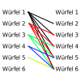
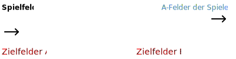

# 40. Bundeswettbewerb für Informatik - Aufgabe 4 (Würfelglück)

## Aufgabenstellung

Hilf den Freunden und schreibe ein Programm, das eine Liste von Würfeln einliest und bestimmt, wie gut diese Würfel geeignet sind, um das Spiel zu gewinnen. Vergleiche dazu jeden Würfel mit jedem anderen. Um festzustellen, welche von zwei gegebenen Würfeln besser ist, simuliere ausreichend viele Spiele zweier Personen, wobei beide je einen der Würfel verwenden. Natürlich sollen in der Hälfte der Simulationen die erste Person anfangen und in der anderen die andere. Eine genaue Beschreibung für die Simulation gültigen Spielregeln findest du auf den BWINF-Webseiten.

## Lösungsidee

Das Hauptziel dieses Algorithmuses ist, anhand einer gegebenen Liste von verschiedenen Würfeln den Würfel mit der besten Gewinnchance zu ermittelnt, indem viele Runden des Spieles "Mensch-ärgere-Dich-nicht" durch den Algorithmus simuliert werden.

## Verwendung des Programmes

Das Programm zur Lösung dieses Problemes befindet sich in der Datei "Aufgabe_4.jar". Das Programm kann mit der Befehlszeile (CMD auf Windows bzw. Terminal auf MacOS) ausgeführt werden.
Dafür navigiert man zuerst in den Ordner der JAR-Datei (hier Aufgabe 4).
Anschließend führt man den Befehl "java -jar Aufgabe_4.jar \<Eingabedatei> \<Ausgabedatei> \<Debug> \<Wiederholungen>" aus.
Die Ausgabedatei ist optional. Wenn keine Ausgabedatei angegeben ist, dann wird das Ergebnis als "output.txt" in dem Ordner der JAR-Datei gespeichert.
Der Parameter "Debug" ist ein boolean und aktiviert die Ausgabe des Spielfeldes und der Abläufe, während der Algorithmus läuft. Dies ist standardmäßig ausgeschaltet.
Der Parameter "Wiederholungen" ist ein Integer und gibt die Anzahl an Wiederholungen der Simulationen der einzelnen Würfel an. Der Standardwert hierfür ist 10000 Wiederholungen.

## Implementierung

### Einlesen der Beispieldateien

```java
//Lesen der einzelnen Zeilen der Datei
String line;
while((line = streamReader.readLine()) != null) contentBuilder.append(line).append("\n");

//Aufteilen des gelesenen Textes in die einzelnen Zeilen
String[] contentLines = contentBuilder.toString().split("\n");

//Interpretieren der Daten
int diceCount = Integer.parseInt(contentLines[0]);

for(int i = 0; i < diceCount; i++)
    dices.add(new LudoDice(contentLines[1 + i]));
```

Die Beispieldateien werden durch die Klasse "DiceEvaluator" eingelesen und der Liste der Würfel, welche ausgewertet werden sollen, hinzugefügt.
Dabei stellt die erste Zeile der Datei die Anzahl der Würfel dar.
Die folgenden Zeilen beeinhalten die einzelnen Würfel, wobei hier die erste Zahl die Anzahl der Seiten des jeweiligen Würfels angibt.

### Vergleichen der Würfel

```java
//Äußere Schleife, welche die Würfel durchläuft
for (int a = 0; a < dices.size() - 1; a++) {
    //Innere Schleife, welche die Würfel durchläuft
    for (int b = a + 1; b < dices.size(); b++) {
        //Schleife, welche die Simulationen an sich startet
        for (int i = 0; i < SIMULATION_RECURSIONS; i++) {
            //Simulation der beiden Würfel, welche nun gestartet wird
            LudoSimulation simulation = new LudoSimulation(dices.get(a), dices.get(b));
            LudoPlayer winner = simulation.simulate(i < SIMULATION_RECURSIONS / 2);

            //Speichern der Ergebnisse
            if (winner != null) {
                //Das Spiel fiel unentschieden aus
                result.results.put(winner.playerDice, result.results.getOrDefault(winner.playerDice, 0) + 1);
                result.results.put(simulation.getOtherPlayer(winner).playerDice, result.results.getOrDefault(simulation.getOtherPlayer(winner).playerDice, 0));
            } else {
                //Das Spiel hatte einen Gewinner
                result.results.put(simulation.playerA.playerDice, result.results.getOrDefault(simulation.playerA.playerDice, 0));
                result.results.put(simulation.playerB.playerDice, result.results.getOrDefault(simulation.playerB.playerDice, 0));
            }
        }
    }
}
```

Zum Vergleichen der Würfel werden drei verschiedene Schleifen verwendet, wodurch alle möglichen Kombinationen ausprobiert werden sollen.  
Die erste Schleife startet mit dem Index 0 und durchläuft die Liste der Würfel bis zum vorletzten Würfel.
Die zweite Schleife startet mit dem Index a (Index der vorherigen Schleife) und durchläuft die Liste der Würfel bis zum letzten Würfel der Liste.  
Mithilfe dieser beiden Schleifen werden alle Kombinationen durchlaufen, ohne dass dabei Kombinationen der Würfel doppelt auftreten. Folgendes Schema kann zur Veranschaulichung dieser Schleifen verwendet werden:



Die letzte Schleife führt dabei die Analyse an sich aus. Diese Schleife wird standardmäßig 10000 mal ausgeführt, um ein aussagekräftiges Ergebnis zu erzielen. Dieser Wert kann aber bei der Ausführung in einer Konsole verändert werden.

Die Schleife startet dann schließlich die Simulation des eigentlichen Spieles mit den beiden Würfeln. Das Ergebnis dieser Simulation wird gespeichert, wobei jeweils die Anzahl der Siege der Würfel gespeichert werden. Wenn diese Analyse vollständig ist, dann kann anhand der Summe der Siege der Würfel bestimmt werden, welcher die höchste Siegeswahrscheinlichkeit besitzt. Dieses Ergebnis wird dann in Form der "EvaluationResult"-Klasse zurückgegeben, welche alle Siegesanzahlen und den besten Würfel beeinhaltet.

Das Ergebnis des Algorithmuses wird anschließend in der angegebenen Ausgabedatei ausgegeben.

### Simulation des Spieles

Der Algorithmus simuliert das Spiel "Mensch ärgere Dich nicht!" nach den folgenden [Spielregeln](https://web.archive.org/web/20201125231030/https://www.schmidtspiele.de/files/Produkte/4/49085%20-%20Mensch%20%C3%A4rgere%20Dich%20nicht%C2%AE/Mensch_aergere_dich_nicht49085D.pdf):

- es treten zwei gegenüberliegende Spieler gegeneinander an
- beide Spieler haben jeweils vier Figuren und einen unterschiedlichen Würfel
- zu Beginn des Spieles befindet sich jeweils eine Figur auf dem A-Feld des Spielers
- wenn eine 6 gewürfelt wird, kann eine weitere Figur eingesetzt werden, wenn das A-Feld nicht durch einen eigenen Spieler blockiert wird
- gegnerische Figuren können besiegt werden und müssen ins B-Feld zurückkehren
- es gewinnt der Spieler, welcher zuerst alle Figuren in den Zielfeldern hat
- Figuren innerhalb der Zielfelder können bewegt werden
- es zieht immer die Figur weiter, welcher am weitesten vorne ist, es sei denn das eigene A-Feld ist blockiert

> **_Hinweis:_** Fast alle Klassen des Programmes besitzen den Präfix "Ludo". Dies ist laut einigen Wörterbüchern eine adäquate Übersetzung für den Spielnamen.

Zur Umsetzung des Spieles im Algorithmus wurde eine Vereinfachung vorgenommen, sodass das Spiel in ein-dimensionaler Form vorliegt. Diese eindimensionale Form ist in der Programmierung ein Array (String). Das Spielfeld an sich befindet sich in der Klasse "LudoField".  
Die Zielfelder der einzelnen Spieler werden in ihren eigenen Klassen (bzw. Instanzen dieser), namens "LudoPlayer" gespeichert.

Originale Form des Spielfeldes:



Vereinfachte Form des Spielfeldes:



Nach der Vereinfachung befindet sich das A-Feld des ersten Spielfeldes im ersten Feld bzw. bei Index 0 des Arrays. Das A-Feld des zweiten Spielers befindet sich folglich im 20. Feld bzw. beim Index 19 des Arrays. Damit eine Runde beendet ist und die Figuren in die Zielfelder gelangen können müssen diese eine Runde vollenden und das Array einmal vollständig durchlaufen. Dies entspricht also einer Strecke von 40 Feldern. Figuren, welche den letzten Index des Arrays erreicht haben, werden wieder an den Anfang des Arrays gesetzt, damit keine IndexOutOfBoundsException entsteht.

Zu Beginn der Simulation werden die ersten Figuren der beiden Spieler mit folgendem Code auf dem Spielfeld platziert.

```java
//Platzieren der ersten Figur des ersten Spielers auf dem Spielfeld
playerA.playersHome--;
playerA.playerTurns = 0;
playerA.playerFigures.get(0).currentPosition = LudoField.POSITION_PLAYER_A_START;
field.mainField[LudoField.POSITION_PLAYER_A_START] = playerA.playerTag;

//Platzieren der ersten Figur des zweiten Spielers auf dem Spielfeld
playerB.playersHome--;
playerB.playerTurns = 0;
playerB.playerFigures.get(0).currentPosition = LudoField.POSITION_PLAYER_B_START;
field.mainField[LudoField.POSITION_PLAYER_B_START] = playerB.playerTag;

//Abbrechen des Spieles, falls einer der Würfel ungültig ist
boolean diceAValid = playerA.playerDice.validate();
boolean diceBValid = playerB.playerDice.validate();

if(!diceAValid && !diceBValid) return null;
            
if(!diceAValid) return playerB;
if(!diceBValid) return playerA;

//Starten der rekursiven Schleife des Algorithmuses
return makeTurn(startWithA ? playerA : playerB);
```

Danach wird die Hauptschleife des Algorithmuses gestartet, indem die Funktion #makeTurn das erste mal aufgerufen wird. Diese Funktion wird rekursiv aufgerufen, bis ein Spieler gewonnen hat und gibt dann den Gewinner des Spielers zurück.  
Bevor das Spiel gestartet werden kann überprüft der Algorithmus noch die Gültigkeit der Würfel. Es kann vorkommen, dass in den Beispiedateien Würfel enthalten sind, welche keine Seite mit der Zahl sechs besitzen. Das Spiel kann demnach nicht angetreten werden, da die Figuren das B-Feld nur verlassen können, wenn eine 6 gewürfelt wird. Wenn dies bei einem Würfel nicht möglich ist, dann gewinnt zwangsläufig der andere Spieler. Wenn beide Würfel ungültig sind, dann endet das Spiel unentschieden.

#### **Wenn der Spieler eine 6 gewürfelt hat**

```java
//Wenn eine 6 gewürfelt wurde und sich noch Figuren auf den B-Feldern befinden
if(moves == 6 && player.playersHome > 0) {
    if(field.mainField[player.playerStartPosition].equals(LudoField.FIELD_EMPTY)) {
        //Wenn sich auf dem A-Feld keine Figur befindet
        player.playersHome--;

        for(LudoFigure figure : player.playerFigures) {
            if(figure.currentPosition == -1) {
                figure.currentPosition = player.playerStartPosition;
                break;
            }
        }

        field.mainField[player.playerStartPosition] = player.playerTag;
        return makeTurn(player);
    } else if(field.mainField[player.playerStartPosition].equals(getOtherPlayer(player).playerTag)) {
        //Wenn sich auf dem A-Feld eine gegnerische Figur befindet
        player.playersHome--;

        //Eine Figur von den B-Feldern wird auf das A-Feld verschoben
        for(LudoFigure figure : player.playerFigures) {
            if(figure.currentPosition == -1) {
                figure.currentPosition = player.playerStartPosition;
                break;
            }
        }

        //Die blockierende gegnerische Figur wird besiegt und auf deren B-Feld zurück verschoben
        for(LudoFigure figure : getOtherPlayer(player).playerFigures) {
            if(figure.currentPosition == player.playerStartPosition) {
                figure.returnToHome();
                getOtherPlayer(player).playersHome++;
                break;
            }
        }

        //Die Position auf dem Hauptfeld wird aktualisiert
        field.mainField[player.playerStartPosition] = player.playerTag;
        return makeTurn(player); //Rekursion, momentaner Spieler ist erneut am Zug
    }
}
```

Wenn der Spieler eine 6 gewürfelt hat und sich noch Figuren auf dem B-Feld des Spielers befinden, dann überprüft der Algorithmus, was sich auf dem A-Feld des Spielers befindet.

Wenn das A-Feld des Spielers leer ist, dann kann die Figur das B-Feld verlassen und wird auf dem A-Feld des Spielers positioniert. Dazu wird eine Figur aus der Liste der Figuren des Spielers ausgewählt, deren Position -1 ist. Dies zeigt an, dass sich die Figur auf dem B-Feld befindet. Anschließend wird das Spielfeld an dieser Stelle aktualisiert.  

Wenn sich auf dem A-Feld des Spielers eine gegnerische Figur befindet, dann wird diese besiegt und die Figur nimmt die Stelle der gegnerischen Figur ein.

Wenn sich auf dem A-Feld jedoch eine eigene Figur befindet, dann wird mit der Funktion fortgefahren, da diese Figur zuerst bewegt werden muss. Anderenfalls würde die Funktion an dieser Stelle erneut rekursiv aufgerufen werden, da der Spieler erneut würfeln darf.

#### **Hauptschleife des Algorithmus**

Wenn der Spieler keine 6 gewürfelt hat, dann muss eine der Figuren des Spielers um die gewürfelte Augenzahl bewegt werden. Die Auswahl der Figur, welche bewegt wird, erfolgt nach bestimmten Prioritäten in einer Schleife. Diese Schleife versucht alle Figuren des Spielers zu bewegen, bis eine Figur gefunden wurde, welche erfolgreich bewegt werden konnte. Wenn keine Figur erfolgreich bewegt werden konnte, dann verfällt der Zug des Spielers und der andere Spieler ist an der Reihe (es sei denn es wurde eine 6 gewürfelt).

Die Auswahl der zu bewegenden Figuren wird mithilfe der Funktion #getMoveList bestimmt:

```java
private ArrayList<LudoFigure> getMoveList(LudoPlayer player) {
    ArrayList<LudoFigure> finalList = new ArrayList<>();

    //Figuren auf dem A-Feld haben die höchste Priorität, da diese so bald wie möglich bewegt werden müssen
    for(LudoFigure figure : player.playerFigures) {
        if(figure.currentPosition == player.playerStartPosition)
            finalList.add(figure);
    }

    //Anschließend werden die verbleibenden Figuren der Position nach absteigend sortiert
    //Es werden die Figuren, welche am weitersten sind, priorisiert
    player.playerFigures.sort(Comparator.comparingInt(figure -> figure.distanceFromStart));
    Collections.reverse(player.playerFigures);

    //Restliche Figuren, welche sich nicht auf dem A-Feld oder auf den B-Feldern befinden
    for(LudoFigure remainingFigure : player.playerFigures) {
        if(remainingFigure.currentPosition != player.playerStartPosition && remainingFigure.currentPosition != -1)
            finalList.add(remainingFigure);
    }

    //Priorisierte Liste wird zurückgegeben
    return finalList;
}
```

Dabei gelten die folgenden Regeln:

- Figuren, welche sich auf dem A-Feld befinden werden zuerst betrachtet, da diese Platz schaffen müssen
- Figuren, welche sich auf den Zielfeldern befinden werden anschließend betrachtet, da auch diese bewegt werden können und somit Platz für weitere Figuren im Ziel schaffen können
- Die restlichen Figuren werden der Größe nach absteigend betrachtet, sodass die Figuren, welche am weitesten sind, zuerst betrachtet werden

Aufgrund der sehr großen Augenzahlen mancher Würfel entsteht ein weiteres Problem. Unter Umständen kann es passieren, dass sich eine Figur zum Beispiel ein Feld vor den Zielfeldern befindet. Wenn nun jetzt aber die kleinste Augenzahl des Würfels 6 ist, dann kann diese Figur das Ziel des Spielers niemals erreichen. Um zu verhindern, dass das Programm nicht mehr stoppt (bzw. ein StackOverflowError entsteht) muss das Spiel an dieser Stelle abgebrochen werden.  
In diesem Fall gewinnt dann jeweils der andere Spieler.  
Wenn jedoch beide Spieler ihre Figuren nicht mehr bewegen können, dann gewinnt der Spieler, welcher mehr Figuren auf seinen Zielfeldern hat. Um dieses Problem zu behandeln wird der folgende Code verwendet:

```java
//Kann der eigene/gegnerische Spieler das Ziel überhaupt erreichen?
boolean ownGoalReachable = targetFigure.isGoalReachable(player.playerDice.getSmallestSide());
boolean enemyGoalReachable = getOtherPlayer(player).isGoalReachableByAll();

//Wenn beide Spieler das Ziel nicht mehr erreichen können, endet das Spiel unentschieden, bzw. der Spieler mit den meisten Figuren im Ziel gewinnt
if(!ownGoalReachable && !enemyGoalReachable) {
    if(player.getFiguresInGoal() == getOtherPlayer(player).getFiguresInGoal()) return null;
    return player.getFiguresInGoal() > getOtherPlayer(player).getFiguresInGoal() ? player : getOtherPlayer(player);
} else if(!ownGoalReachable) return getOtherPlayer(player);
//Der gegnerische Spieler gewinnt, wenn nur der eigene Spieler das Zielfeld nicht mehr erreichen kann
```

#### **Wenn sich eine Figur auf einem Zielfeld befindet**

```java
//Wenn sich die Spielfigur innerhalb der Zielfelder befindet
if(targetFigure.currentPosition < 0 || targetFigure.distanceFromStart > LudoField.ROUND_COMPLETE) {
//Wenn die Figur jedoch auf dem letzten Feld ist, dann wird zur nächsten Figur gesprungen
if(targetFigure.distanceFromStart + moves >= LudoField.ROUND_COMPLETE + player.playersGoal.length)
    continue;

//Neue Position innerhalb der Zielfelder wird berechnet
int currentGoalPosition = targetFigure.distanceFromStart - LudoField.ROUND_COMPLETE;
int positionInGoal = (targetFigure.distanceFromStart + moves) - LudoField.ROUND_COMPLETE;

//Wenn das Zielfeld leer ist, dann wird die Figur bewegt
if(player.playersGoal[positionInGoal].equals(LudoField.FIELD_EMPTY)) {
    player.playersGoal[currentGoalPosition] = LudoField.FIELD_EMPTY;
    player.playersGoal[positionInGoal] = player.playerTag;
    targetFigure.moveToGoal(positionInGoal);
        return makeTurn(moves == 6 ? player : getOtherPlayer(player));
    } else continue;
    //Andernfalls wird zur nächsten Figur gesprungen
}
```

Wenn sich bereits eine Figur auf den Zielfeldern befindet, dann kann diese Figur bei der richtigen Augenzahl bis ans Ende der Zielfelder vorspringen, um Platz für andere Figuren zu schaffen, welche später auch die Zielfelder erreichen sollen.  
Wenn das Zielfeld, in welches die Figur kommen würde, jedoch belegt ist, dann springt der Algorithmus an dieser Stelle in der Liste der Figuren zur nächsten Figur (continue-Keyword).

#### **Wenn sich eine Figur vor den Zielfeldern befindet**

```java
//Wenn sich die Spielfigur kurz vor den Zielfeldern befindet
if(targetFigure.distanceFromStart + moves >= LudoField.ROUND_COMPLETE) {
    //Wenn die Figur jedoch über das Ziel hinausspringen würde, dann wird zur nächsten Figur gesprungen
    if(targetFigure.distanceFromStart + moves >= LudoField.ROUND_COMPLETE + player.playersGoal.length)
        continue;

    //Position innerhalb der Zielfelder wird berechnet
    int positionInGoal = (targetFigure.distanceFromStart + moves) - LudoField.ROUND_COMPLETE;

    //Wenn das Zielfeld leer ist, dann wird die Figur bewegt
    if(player.playersGoal[positionInGoal].equals(LudoField.FIELD_EMPTY)) {
        //Figur wird auf das Zielfeld verschoben
        player.playersGoal[positionInGoal] = player.playerTag;
        field.mainField[targetFigure.currentPosition] = LudoField.FIELD_EMPTY;
        targetFigure.moveToGoal(positionInGoal);

        //Überprüfen, ob einer der beiden Spieler gewonnen hat
        if(player.playersHome == 0 && player.goalComplete()) {
            if(getOtherPlayer(player).goalComplete() && getOtherPlayer(player).goalComplete()) {
                if(debugOutput) System.out.println("DRAW! Both players have all their figures in the goals.");
                
                return null; //Unentschieden
            }

            if(debugOutput) System.out.println("Player " + player.playerTag + " won the game! Turns needed: " + player.playerTurns);
            
            return player; //Spieler hat gewonnen
        }

        //Weitergeben des Zuges
        return makeTurn(moves == 6 ? player : getOtherPlayer(player));
    } else continue; //Andernfalls wird zur nächsten Figur gesprungen
}
```

Wenn sich eine Figur vor den Zielfeldern befindet und mit der gewürfelten Augenzahl in einem der Zielfelder landet, dann wird dieses dort platziert. Wenn das Zielfeld jedoch belegt ist, dann springt der Algorithmus zu der nächsten Figur in der Liste (continue-Keyword).

Außerdem wird an dieser Stelle überprüft, ob sich alle Figuren eines Spielers in den Zielfeldern befinden. Falls dies der Fall ist, so gewinnt einer der beiden Spieler.
Wenn beide Spieler alle Figuren auf den Zielfeldern haben, dann endet das Spiel unentschieden. Aufgrund der Tatsache, dass die Spieler nacheinander ziehen, darf dieser Fall theoretisch niemals eintreten.

#### **Normales Weiterziehen der Figur auf dem Spielfeld**

```java
if(field.mainField[finalPosition].equals(LudoField.FIELD_EMPTY)) {
    //Wenn das Feld, welches die Figur erreichen würde, leer ist, wird die Figur auf das Feld bewegt
    field.mainField[targetFigure.currentPosition] = LudoField.FIELD_EMPTY;
    field.mainField[finalPosition] = player.playerTag;
    targetFigure.move(finalPosition, moves);

    //Zug wird weitergegeben
    return makeTurn(moves == 6 ? player : getOtherPlayer(player));
} else if(field.mainField[finalPosition].equals(getOtherPlayer(player).playerTag)) {
    //Wenn sich eine gegnerische Figur auf dem Feld befindet, so wird diese besiegt und muss auf deren B-Felder zurück
    field.mainField[targetFigure.currentPosition] = LudoField.FIELD_EMPTY;
    field.mainField[finalPosition] = player.playerTag;
    targetFigure.move(finalPosition, moves);

    //Die Figur des Gegners wird auf das B-Feld zurück bewegt
    for(LudoFigure figure : getOtherPlayer(player).playerFigures) {
        if(figure.currentPosition == finalPosition) {
            figure.returnToHome();
            getOtherPlayer(player).playersHome++;
            break;
        }
    }

    //Zug wird weitergegeben
    return makeTurn(moves == 6 ? player : getOtherPlayer(player));
}
```

Wenn keiner der beschriebenen Fälle eingetreten ist, dann wird die Figur auf dem Feld weiter in Richtung Ziel bewegt. Dabei überprüft der Algorithmus auch wieder, ob sich eine Figur auf dem Feld befindet, zu welchem die Figur springen soll.  
Wenn sich keine Figur auf dem Feld befindet, dann kann die momentane Figur auf dieses Feld springen und die Funktion wird rekursiv aufgerufen.  
Wenn sich eine gegenerische Figur auf dem Feld befindet, dann wird diese besiegt und die eigene Figur wird auf diesem Feld platziert.  
Wenn sich jedoch eine eigene Figur auf dem Feld befindet, dann springt der Algorithmus zu der nächsten Figur in der Liste (continue-Keyword), da diese Figur zuerst bewegt werden muss.

#### **Ende der Schleife**

Wenn keine Figur erfolgreich verschoben werden konnte, dann wird die Funktion rekursiv aufgerufen, sodass der nächste Spieler an der Reihe ist (bzw. der gleiche wenn eine 6 gewürfelt wurde).

## Beispiele

### Beispiel 1 (wuerfel0.txt)

Mit Würfel 1 [1, 1, 1, 6, 6, 6] wurde 18827 mal gewonnen  
Mit Würfel 2 [1, 2, 3, 4, 5, 6] wurde 29016 mal gewonnen  
Mit Würfel 3 [0, 1, 2, 3, 4, 5, 6, 7, 8, 9] wurde 49850 mal gewonnen  
Mit Würfel 4 [1, 2, 3, 4] wurde 0 mal gewonnen  
Mit Würfel 5 [1, 2, 3, 4, 5, 6, 7, 8, 9, 10, 11, 12] wurde 23948 mal gewonnen  
Mit Würfel 6 [1, 2, 3, 4, 5, 6, 7, 8, 9, 10, 11, 12, 13, 14, 15, 16, 17, 18, 19, 20] wurde 26830 mal gewonnen  

Der Würfel [0, 1, 2, 3, 4, 5, 6, 7, 8, 9] hat demnach die besten Gewinnchancen (Gewonnen: 49850)

### Beispiel 2 (wuerfel1.txt)

Mit Würfel 1 [2, 3, 4, 5, 6, 7] wurde 34523 mal gewonnen  
Mit Würfel 2 [5, 6, 7, 8, 9, 10] wurde 8676 mal gewonnen  
Mit Würfel 3 [4, 5, 6, 7, 8, 9] wurde 14364 mal gewonnen  
Mit Würfel 4 [1, 2, 3, 4, 5, 6] wurde 45187 mal gewonnen  
Mit Würfel 5 [3, 4, 5, 6, 7, 8] wurde 23640 mal gewonnen  
Mit Würfel 6 [6, 7, 8, 9, 10, 11] wurde 7081 mal gewonnen  

Der Würfel [1, 2, 3, 4, 5, 6] hat demnach die besten Gewinnchancen (Gewonnen: 45187)  

### Beispiel 3 (wuerfel2.txt)

Mit Würfel 1 [1, 1, 1, 1, 6, 6] wurde 29116 mal gewonnen  
Mit Würfel 2 [1, 6, 6, 6, 6, 6] wurde 1592 mal gewonnen  
Mit Würfel 3 [1, 1, 6, 6, 6, 6] wurde 10189 mal gewonnen  
Mit Würfel 4 [1, 1, 1, 1, 1, 6] wurde 38684 mal gewonnen  
Mit Würfel 5 [1, 1, 1, 6, 6, 6] wurde 19257 mal gewonnen  

Der Würfel [1, 1, 1, 1, 1, 6] hat demnach die besten Gewinnchancen (Gewonnen: 38684)  

### Beispiel 4 (wuerfel3.txt)

Mit Würfel 1 [1, 2, 5, 6] wurde 20567 mal gewonnen  
Mit Würfel 2 [1, 2, 3, 4, 5, 6, 7, 8, 9, 10, 11, 12] wurde 16378 mal gewonnen  
Mit Würfel 3 [0, 1, 2, 3, 4, 5, 6, 7, 8, 9] wurde 49816 mal gewonnen  
Mit Würfel 4 [1, 2, 3, 4, 5, 6] wurde 21732 mal gewonnen  
Mit Würfel 5 [1, 2, 3, 4, 5, 6, 7, 8] wurde 16862 mal gewonnen  
Mit Würfel 6 [1, 2, 3, 4, 5, 6, 7, 8, 9, 10, 11, 12, 13, 14, 15, 16, 17, 18, 19, 20] wurde 21278 mal gewonnen  

Der Würfel [0, 1, 2, 3, 4, 5, 6, 7, 8, 9] hat demnach die besten Gewinnchancen (Gewonnen: 49816)  