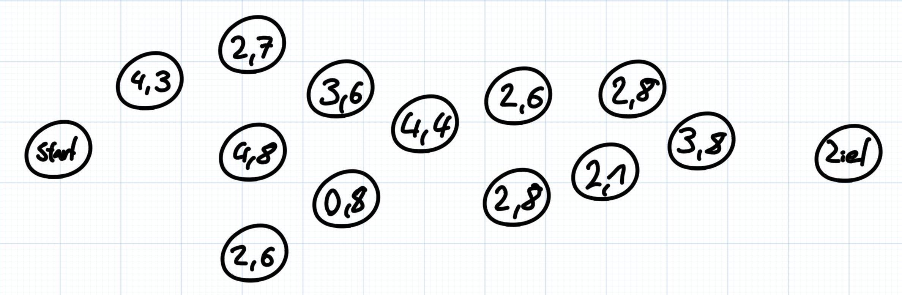
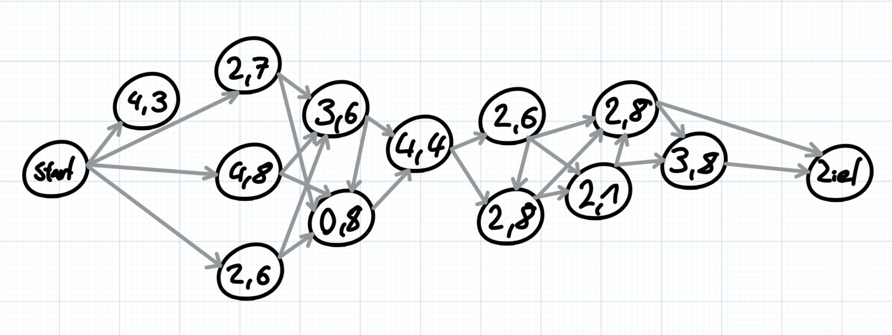
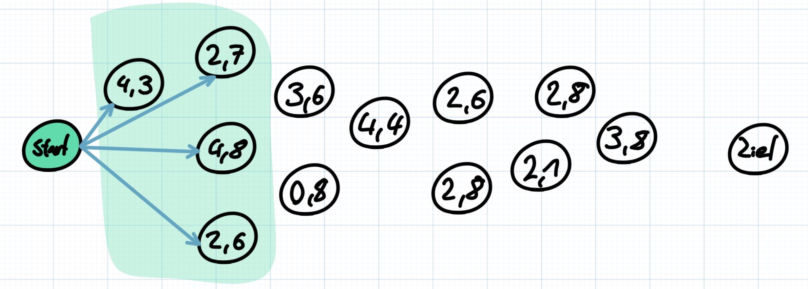
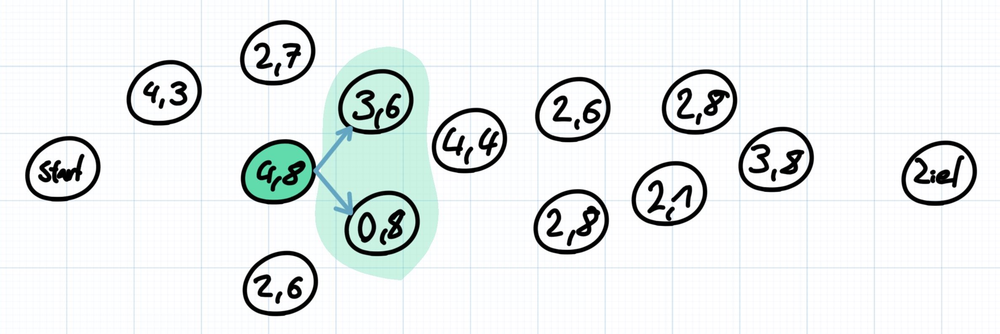
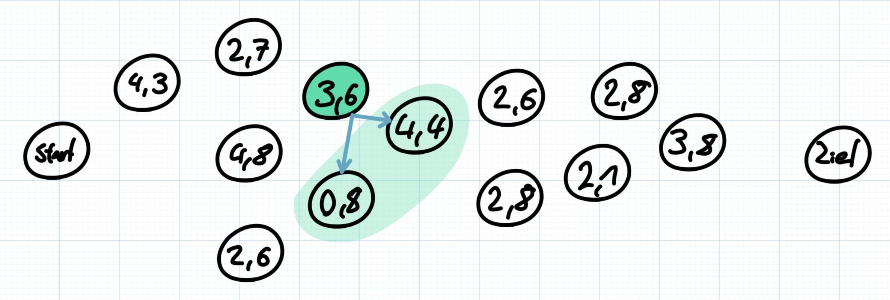
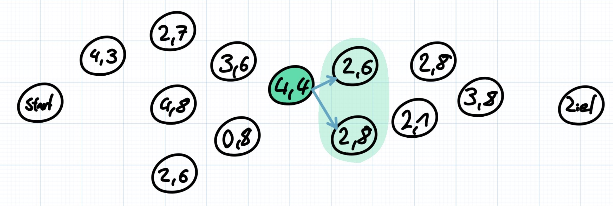
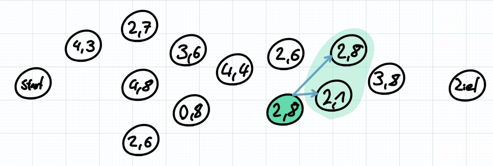
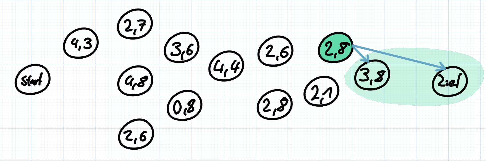
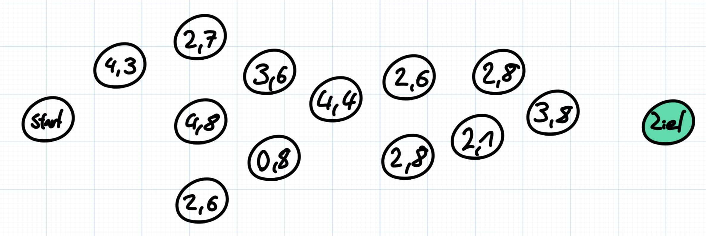

# 40. Bundeswettbewerb für Informatik - Aufgabe 2 (Vollgeladen)

## Aufgabenstellung

Schreibe ein Programm, das die Auswahl der Hotels übernimmt. Dein Programm soll die Angaben zu den Hotels, nämlich ihre Positionen entlang der Route und ihre Bewertungen, einlesen und eine Auswahl nach den Wünschen von Lara und Paul ausgeben.

## Lösungsidee

Das Hauptziel des Algorithmuses ist es, eine Route zu finden, welche die gegebenen Hotels verbindet. Dabei soll die Bewertung des schlechtesten Hotels möglichst hoch sein. Die Grundlage dieses Algorithmuses besteht darin, alle Verknüpfungsmöglichkeiten auszuprobieren (Brute-Force). Dabei werden jedoch mehrere Abbruchbedingungen verwendet, damit das Ausprobieren der Möglichkeiten überhaupt möglich ist (Zeit + Speicher).  
Erste Abbruchbedingung: Wenn eine Route schon länger als 5 Tage ist, wird die Iteration abgebrochen und die Route verworfen.  
Zweite Abbruchbedingung: Wenn die momentane Route schlechter ist, als die Routen, welche bereits ausprobiert worden, dann wird die Iteration abgebrochen und die Route verworfen.  
Dritte Abbruchbedingung: Wenn das Ziel vom momentanen Standpunkt bereits erreichbar ist, dann wird die Iteration abgebrochen und die Route gespeichert.  
Wenn dieser Teil des Algorithmuses abgeschlossen wurde, dann existiert eine Liste, mit mehreren Routen, welche gespeichert wurden. Um die optimale Route herauszufinden, muss der Algorithmus nur noch die Route mit dem besten schlechtesten Hotel und der besten Durchschnittsbewertung ermitteln und ausgeben.

## Verwendung des Programmes

Das Programm zur Lösung dieses Problemes befindet sich in der Datei "Aufgabe_2.jar". Das Programm kann mit der Befehlszeile (CMD auf Windows, bzw. Terminal auf MacOS) ausgeführt werden. Dafür navigiert man zuerst in den Ordner der JAR-Datei (hier Aufgabe 2). Anschließend führt man den Befehl "java -jar Aufgabe_2.jar \<Eingabedatei> \<Ausgabedatei>" aus.
Die Eingabedateien befinden sich in dem Ordner "Examples" (Beispiel: "Examples/hotels0.txt").
Die Ausgabedatei ist optional. Wenn keine Ausgabedatei angegeben ist, dann wird das Ergebnis als "output.txt" in dem Ordner der JAR-Datei gespeichert.

## Implementierung

### Einlesen der Beispieldateien

Der folgende Code liest eine der Beispieldateien ein und verwendet die enthaltenen Informationen, um ein Objekt der "RoutePlan"-Klasse erstellen zu können.
Diese Klasse beeinhaltet alle Information zur geplanten Route und stellt die Hauptklasse des implementierten Algorihtmuses dar.

```java
//Lesen der einzelnen Zeilen der Datei
String line;
while((line = streamReader.readLine()) != null) contentBuilder.append(line).append("\n");

//Aufteilen des gelesenen Textes in die einzelnen Zeilen
String[] contentLines = contentBuilder.toString().split("\n");

//Interpretieren der Daten
//Diese Anweistung ließt die ersten beiden Zeilen der Datei und speichert diese (Gesamtzahl Hotels und Reisezeit)
totalHotels = Integer.parseInt(contentLines[0]);
totalTripMinutes = Long.parseLong(contentLines[1]);

//Diese Schleife ließt alle restlichen Zeilen und erstellt daraus die Liste an Hotels, welche sich auf der Route befinden
for(int i = 0; i < totalHotels; i++) {
    String hotelLine = contentLines[i + 2];
    hotels.add(new Hotel(hotelLine));
}
```

Zum Einlesen der Hotels aus der Datei wird der folgende Code zusätzlich verwendet.

```java
//Einlesen des Abstandes vom Startpunkt (in Minuten)
distanceFromStart = Long.parseLong(rawText.split(" ")[0]);
//Einlesen der durchschnittlichen Bewertung des Hotels
averageRating = Float.parseFloat(rawText.split(" ")[1]);
```

### Berechnen der besten Route

Zum Berechnen der optimalen Route werden insgesamt drei Funktionen verwendet.
Die erste Funktion (RoutePlan#calculateOptimalRoute) ist die Hauptfunktion des Algorithmuses und startet die Suche nach der besten Route.

```java
public Route calculateOptimalRoute() {
    //Rekursives Ausprobieren der möglichen Pfade wird gestartet
    //In dieser Liste landen am Ende alle Pfade, welche durch den Algorithmus ermittelt wurden
    ArrayList<Route> allAvailableRoutes = iterateHotel(hotels, new Route(), 0);

    //Diese Schleife ermittelt aus dieser Liste die beste Route
    Route finalRoute = allAvailableRoutes.get(0);
    for(Route candidate : allAvailableRoutes) {
        if(candidate.getLowestHotelRating() > finalRoute.getLowestHotelRating() && candidate.getAverageHotelRating() > finalRoute.getAverageHotelRating())
            finalRoute = candidate; //Beste Route wird ermittelt (bestes schlechtestes Hotel & bester Durchschnittswert)
    }

    //Die ermittelte Route wird zurückgegeben
    return finalRoute;
}
```

Die zweite Funktion des Algorithmuses ist die Funktion, welche alle möglichen Routen rekursiv berechnet (RoutePlan#iterateHotel).

```java
public ArrayList<Route> iterateHotel(ArrayList<Hotel> allHotels, Route currentRoute, long traveledDistance) {
    //Diese Liste beeinhaltet am Ende alle ermittelten Routen
    ArrayList<Route> resolvedRoutes = new ArrayList<>();

    if(traveledDistance < totalTripMinutes - MAX_STEPSIZE) { //Abbruchbedingung 3: Ist das Ziel vom momentanen Standort aus erreichbar?
        if(currentRoute.hotels.size() <= MAX_TRAVELTIME - 1) { //Abbruchbedingung 1: Dauert die Reise schon zu lange?
            for(Hotel inRange : getHotelsInRange(allHotels, traveledDistance)) {
                //Abbruchbedingung 2: Ist das Hotel schlechter, als bereits gewählt Pfade?
                if(inRange.averageRating > ratingThreshold)
                    //Funktion wird rekursiv aufgerufen um von dem nächsten Hotel alle möglichen Routen zu berechnen
                    resolvedRoutes.addAll(iterateHotel(allHotels, new Route(currentRoute).appendHotel(inRange), inRange.distanceFromStart));
                }
            }
        } else {
            if(currentRoute.getLowestHotelRating() > ratingThreshold && currentRoute.hotels.size() <= MAX_TRAVELTIME) { //Abbruchbedingungen 1 und 2
                ratingThreshold = currentRoute.getLowestHotelRating(); //Neuer Mindestwert für Abbruchbedingung 2 wird gesetzt
                resolvedRoutes.add(currentRoute); //Route wird den möglichen Routen hinzugefügt
            }
        }

    //Rückgabe aller ermittelten Routen
    return resolvedRoutes;
}
```

Die dritte Funktion des Algorithmuses ermittelt alle Hotels, welche von der momentanen Position aus erreichbar sind. Dazu wird überprüft, ob die Differenz der momentanen Position und der Distanz des Hotels vom Start zwischen 0 und 360 Minuten liegt.

```java
public ArrayList<Hotel> getHotelsInRange(ArrayList<Hotel> availableHotels, long traveledDistance) {
    ArrayList<Hotel> hotelsInRange = new ArrayList<>();
    for(Hotel hotel : availableHotels)
        if(hotel.distanceFromStart > traveledDistance && hotel.distanceFromStart <= traveledDistance + MAX_STEPSIZE) //Ist das Hotel erreichbar
            hotelsInRange.add(hotel); //Hotel wird der Liste hinzugefügt

    //Liste wird sortiert, damit der Algorithmus optimaler arbeitet
    hotelsInRange.sort((hotelA, hotelB) -> Float.compare(hotelA.averageRating, hotelB.averageRating));
    //Die Liste wird umgekehrt, damit die besten Bewertungen zuerst berechnet werden
    Collections.reverse(hotelsInRange);

    //Rückgabe der Liste aller erreichbaren Hotels
    return hotelsInRange;
}
```

## Beispiele

### Beispiel 1 (hotels1.txt)

Gesamtzahl Hotels: 12  
Gesamtfahrzeit: 1680 min

**Optimale Route:**  
Hotel 1: 326 min / 4.8 Sterne  
Hotel 2: 553 min / 3.6 Sterne  
Hotel 3: 687 min / 4.4 Sterne  
Hotel 4: 1007 min / 2.8 Sterne  
Hotel 5: 1360 min / 2.8 Sterne  




#### **Erster Schritt**



Im ersten Schritt sucht der Algorithmus alle Hotels, welche vom momentanen Standpunkt aus (Startpunkt) erreichbar sind. Ein Hotel ist erreichbar, wenn die Differenz zwischen dem Abstand vom Start und der momentanen Position maximal 360 Minuten beträgt.
Beispiel: position = 0; hotel = 325; hotel - position = 325 < 360  
Danach sucht der Algorithmus das Hotel mit der besten Bewertung, in diesem Fall sind das 4,8 Sterne. Die Prozedur wird dann für dieses Hotel erneut ausgeführt.

#### **Zweiter Schritt**



In diesem Schritt sind nur die Hotels mit 3,6 und 0,8 Sternen erreichbar. Deshalb wählt der Algorithmus das Hotel mit 3,6 Sternen und die Prozedur wird erneut aufgerufen.

#### **Dritter Schritt**



In diesem Schritt sind nur die Hotels mit 0,8 und 4,4 Sternen erreichbar. Deshalb wählt der Algorithmus das Hotel mit 4,4 Sternen und die Prozedur wird erneut aufgerufen.

#### **Vierter Schritt**



In diesem Schritt sind nur die Hotels mit 2,6 und 2,8 Sternen erreichbar. Deshalb wählt der Algorithmus das Hotel mit 2,8 Sternen und die Prozedur wird erneut aufgerufen.

#### **Fünfter Schritt**



In diesem Schritt sind nur die Hotels mit 2,1 und 2,8 Sternen erreichbar. Deshalb wählt der Algorithmus das Hotel mit 2,8 Sternen und die Prozedur wird erneut aufgerufen.

#### **Sechster Schritt**



In diesem Schritt ist nur das Hotel mit 3,8 Sternen erreichbar. Jedoch kann man vom momentanen Standpunkt aus das Ziel direkt erreichen, da es sich in der Reichweite von 360 Minuten befindet. Daher überspringt der Algorithmus das letzte Hotel und bewegt sich direkt zum Ziel.

#### **Ziel erreicht**



Nachdem der Algorithmus das Ziel erreicht hat, wird die verfolgte Route gespeichert. Anschließend wird der Wert des schlechtesten Hotels der Route, also in diesem Fall 2,8 Sterne gespeichert. Dann wird der Algorithmus erneut begonnen. Diesmal werden jedoch alle Routen, deren schlechtestes Hotel schlechter ist, als der neue Schwellenwert verworfen. Am Ende können also nur noch bessere Routen, als die erste Iteration gespeichert werden. Jedes Mal nachdem eine neue (bessere) Route gefunden wird, wird der Wert des schlechtesten Hotels erneut gespeichert. Wenn irgendwann keine Routen mehr verfügbar sind und alle Kombinationen somit erschlossen wurden, sucht der Algorithmus die beste Route aus allen abgeschlossenen Routen aus. Dabei wird das beste schlechteste Hotel und die Route mit den besten durchschnittlichen Hotelbewertungen gewählt.

### Beispiel 2 (hotels2.txt)

Gesamtzahl Hotels: 25  
Gesamtfahrtzeit: 1737 min

**Optimale Route:**  
Hotel 1: 341 min / 2.3 Sterne  
Hotel 2: 442 min / 5.0 Sterne  
Hotel 3: 700 min / 3.0 Sterne  
Hotel 4: 1053 min / 4.8 Sterne  
Hotel 5: 1380 min / 5.0 Sterne  

### Beispiel 3 (hotels3.txt)

Gesamtzahl Hotels: 500  
Gesamtfahrzeit: 1793 min

**Optimale Route:**  
Hotel 1: 302 min / 4.9 Sterne  
Hotel 2: 613 min / 5.0 Sterne  
Hotel 3: 838 min / 4.8 Sterne  
Hotel 4: 1120 min / 4.8 Sterne  
Hotel 5: 1471 min / 4.8 Sterne  

### Beispiel 4 (hotels4.txt)

Gesamtzahl Hotels: 500  
Gesamtfahrzeit: 1510 min

**Optimale Route:**  
Hotel 1: 173 min / 5.0 Sterne  
Hotel 2: 467 min / 4.9 Sterne  
Hotel 3: 791 min / 5.0 Sterne  
Hotel 4: 1060 min / 5.0 Sterne  
Hotel 5: 1301 min / 5.0 Sterne  

### Beispiel 5 (hotels5.txt)

Gesamtzahl Hotels: 1500  
Gesamtfahrzeit: 1616 min

**Optimale Route:**  
Hotel 1: 317 min / 5.0 Sterne  
Hotel 2: 636 min / 5.0 Sterne  
Hotel 3: 987 min / 5.0 Sterne  
Hotel 4: 1286 min / 5.0 Sterne  